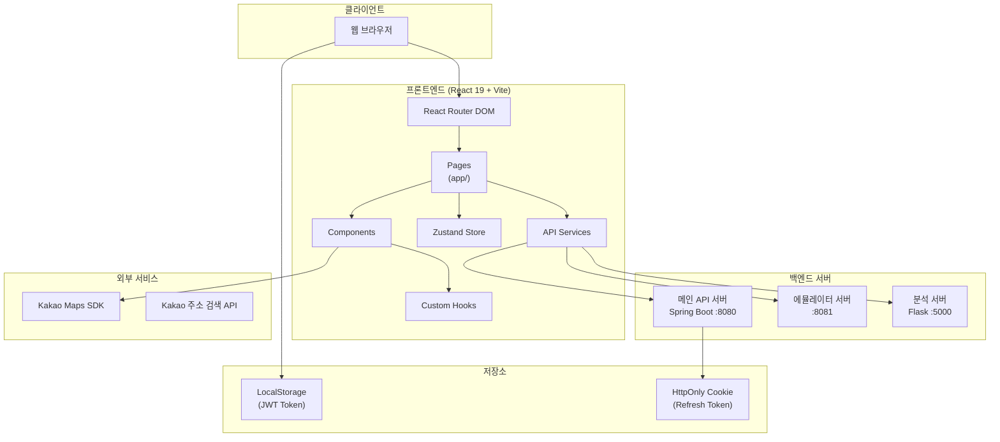
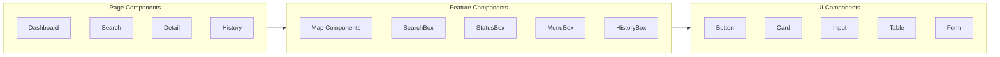
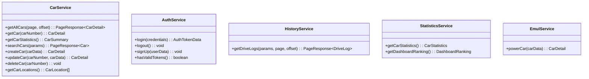
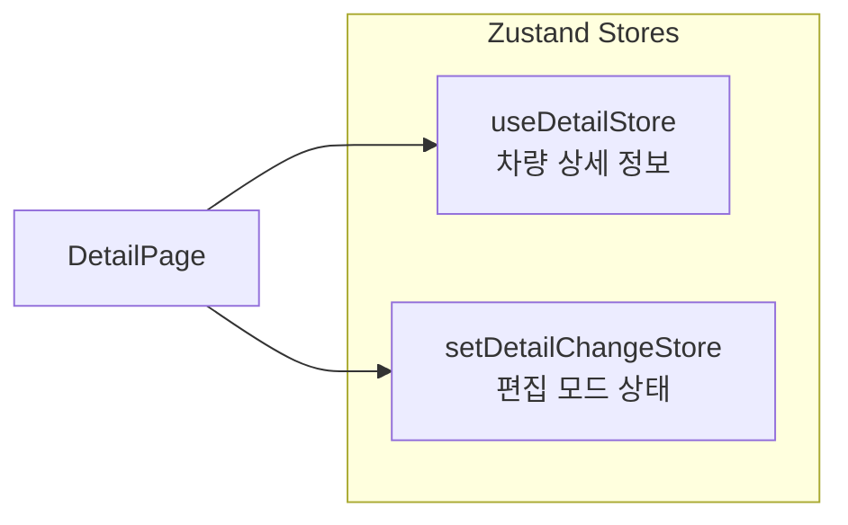
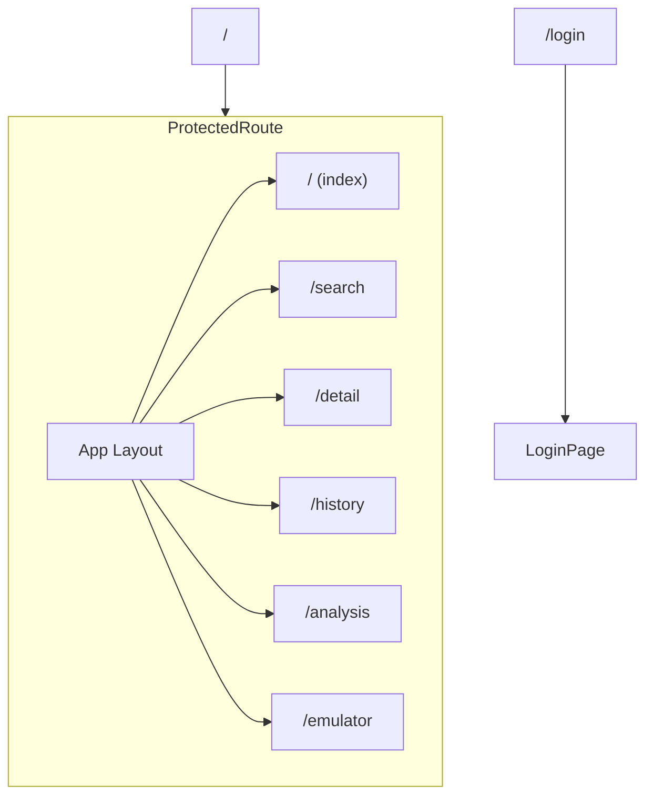
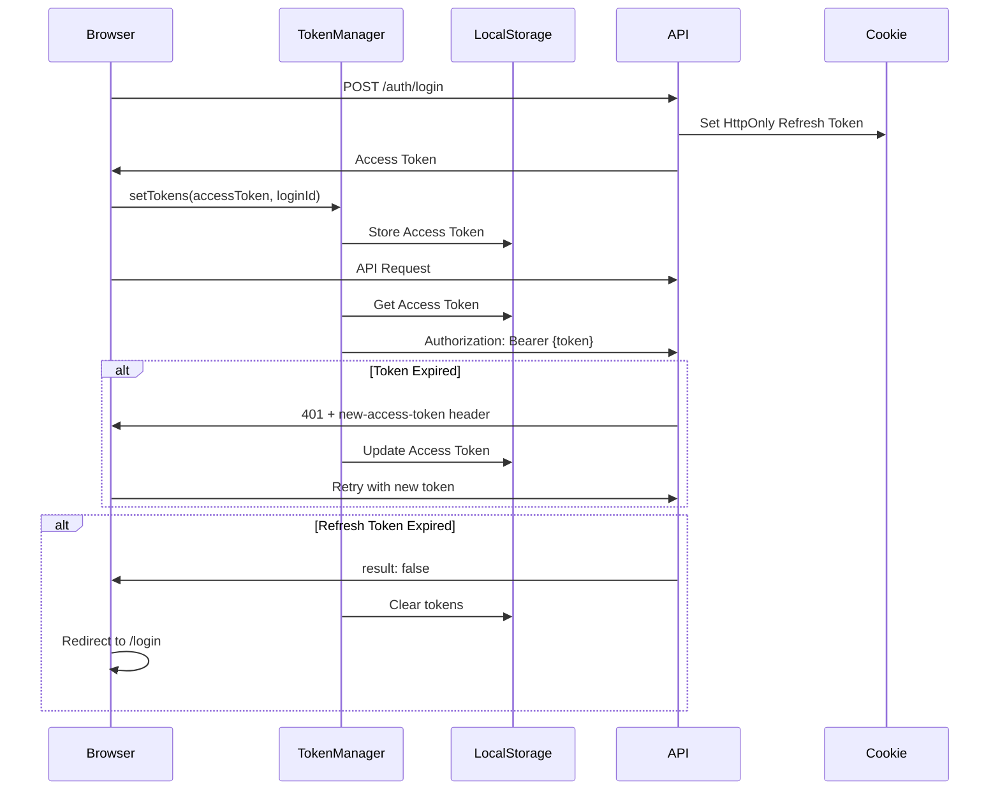
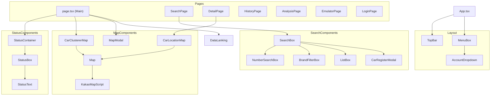

# 시스템 아키텍처

> 2 the Core 차량 관제 시스템의 전체 아키텍처 문서

---

## 개요

2 the Core는 React 19 기반의 SPA(Single Page Application)로, 3개의 백엔드 서버와 통신하여 차량 관제 기능을 제공합니다.

---

## 시스템 구성도



---

## 레이어 아키텍처

### 1. 프레젠테이션 레이어 (Pages)

페이지 컴포넌트는 라우트와 1:1로 매핑됩니다.

| 파일 | 경로 | 역할 |
|------|------|------|
| [src/app/page.tsx](../src/app/page.tsx) | `/` | 메인 대시보드 |
| [src/app/search/page.tsx](../src/app/search/page.tsx) | `/search` | 차량 검색 |
| [src/app/detail/page.tsx](../src/app/detail/page.tsx) | `/detail` | 차량 상세 |
| [src/app/history/page.tsx](../src/app/history/page.tsx) | `/history` | 주행 기록 |
| [src/app/analysis/page.tsx](../src/app/analysis/page.tsx) | `/analysis` | 데이터 분석 |
| [src/app/emulator/page.tsx](../src/app/emulator/page.tsx) | `/emulator` | 에뮬레이터 |
| [src/app/login/page.tsx](../src/app/login/page.tsx) | `/login` | 로그인 |

### 2. 컴포넌트 레이어



#### 주요 컴포넌트

| 컴포넌트 | 파일 | 역할 |
|----------|------|------|
| `CarClustererMap` | [src/components/map/car-clusterer-map.tsx](../src/components/map/car-clusterer-map.tsx) | 차량 클러스터링 지도 |
| `CarLocationMap` | [src/components/map/car-location-map.tsx](../src/components/map/car-location-map.tsx) | 개별 차량 위치 지도 |
| `SearchBox` | [src/components/search-box/search-box.tsx](../src/components/search-box/search-box.tsx) | 차량 검색 시스템 |
| `StatusContainer` | [src/components/status-box/status-container.tsx](../src/components/status-box/status-container.tsx) | 차량 상태 카운터 |
| `MenuBox` | [src/components/menu-box/menu-box.tsx](../src/components/menu-box/menu-box.tsx) | 네비게이션 메뉴 |
| `ProtectedRoute` | [src/components/ProtectedRoute.tsx](../src/components/ProtectedRoute.tsx) | 인증 보호 라우트 |

### 3. 서비스 레이어

API 통신을 담당하는 서비스 클래스들입니다.



| 서비스 | 파일 | 역할 |
|--------|------|------|
| `CarService` | [src/services/car-service.ts](../src/services/car-service.ts) | 차량 CRUD 및 검색 |
| `AuthService` | [src/services/auth-service.ts](../src/services/auth-service.ts) | 로그인/로그아웃/회원가입 |
| `HistoryService` | [src/services/history-service.ts](../src/services/history-service.ts) | 주행 기록 조회 |
| `StatisticsService` | [src/services/statistics-service.ts](../src/services/statistics-service.ts) | 통계 데이터 |
| `EmulService` | [src/services/emul-service.ts](../src/services/emul-service.ts) | 에뮬레이터 제어 |

### 4. 상태 관리 레이어 (Zustand)



| 스토어 | 파일 | 역할 |
|--------|------|------|
| `useDetailStore` | [src/store/detail-store.ts](../src/store/detail-store.ts) | 차량 상세 정보 상태 |
| `setDetailChangeStore` | [src/store/detail-change.ts](../src/store/detail-change.ts) | 편집 모드 토글 |

### 5. API 클라이언트 레이어

[src/lib/api.ts](../src/lib/api.ts)에서 Axios 인스턴스를 설정합니다.

```typescript
// 3개의 API 인스턴스
export const mainApi = createApiInstance(API_BASE_URL);        // 메인 API
export const emulatorApi = createApiInstance(EMULATOR_API_BASE_URL); // 에뮬레이터 API
export const analysisApi = createFlaskApiInstance(ANALYSIS_API_BASE_URL); // 분석 API
```

#### API 인터셉터 기능

- **요청 인터셉터**: JWT 토큰 자동 추가
- **응답 인터셉터**: 토큰 갱신, 자동 로그아웃 처리
- **에러 핸들링**: 한국어 에러 메시지 매핑

---

## 라우팅 구조

[src/main.tsx](../src/main.tsx)에서 라우팅을 설정합니다.



### 라우트 보호

```typescript
// src/components/ProtectedRoute.tsx
// JWT 토큰 검증 후 인증된 사용자만 접근 허용
<ProtectedRoute>
  <App />  {/* 인증된 라우트들 */}
</ProtectedRoute>
```

---

## 인증 아키텍처

### JWT 토큰 관리



### TokenManager 클래스

[src/lib/token-manager.ts](../src/lib/token-manager.ts)

| 메서드 | 설명 |
|--------|------|
| `setTokens(accessToken, loginId)` | 로그인 시 토큰 저장 |
| `updateAccessToken(accessToken)` | 토큰 갱신 |
| `getAuthHeader()` | `Bearer {token}` 헤더 반환 |
| `hasValidTokens()` | 인증 상태 확인 |
| `clearTokens()` | 로그아웃 시 토큰 삭제 |

---

## 컴포넌트 의존성 그래프



---

## 기술 결정 사항

### 1. React 19 선택 이유
- 최신 기능 (Suspense, Concurrent Mode)
- 개선된 성능
- 미래 지향적 호환성

### 2. Zustand 상태 관리
- 경량화된 상태 관리
- React 훅 기반 API
- 보일러플레이트 최소화

### 3. shadcn/ui + Radix UI
- 접근성 내장 컴포넌트
- 완전한 커스터마이징 가능
- Tailwind CSS 통합

### 4. Vite 빌드 도구
- 빠른 개발 서버 (HMR)
- 최적화된 프로덕션 빌드
- TypeScript 네이티브 지원

---

## 관련 문서

- [Data-Flow](Data-Flow) - 데이터 흐름 상세
- [API-Reference](API-Reference) - API 엔드포인트
- [Diagrams](Diagrams) - 다이어그램 모음
