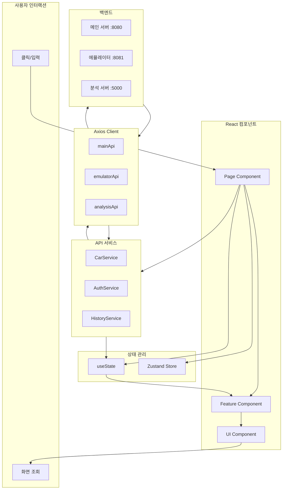
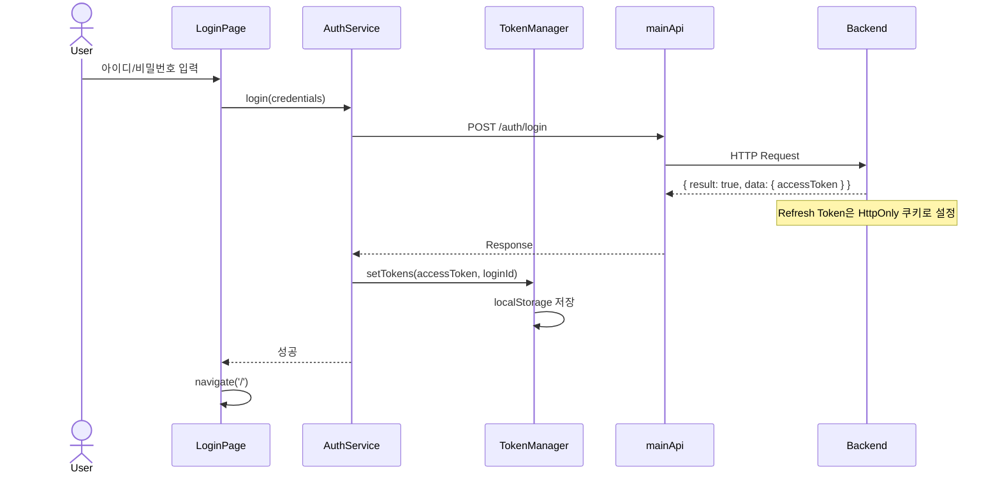
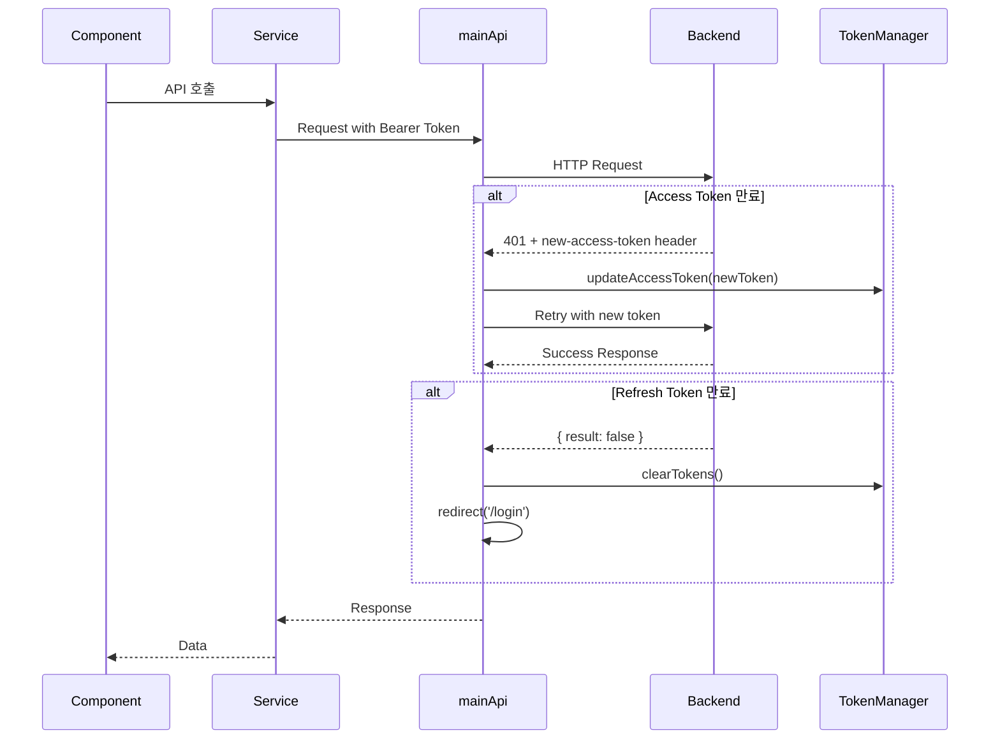
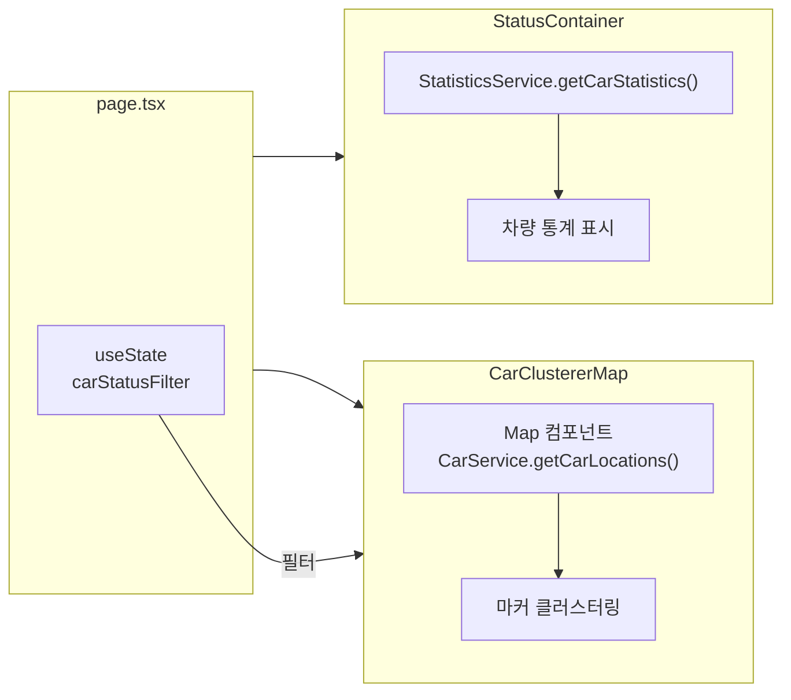
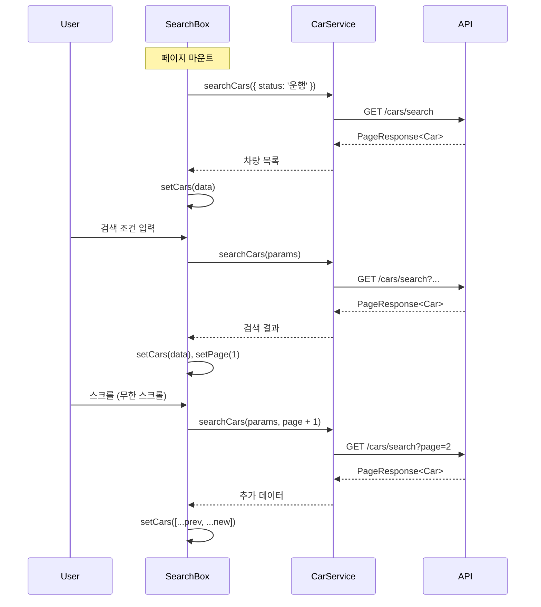
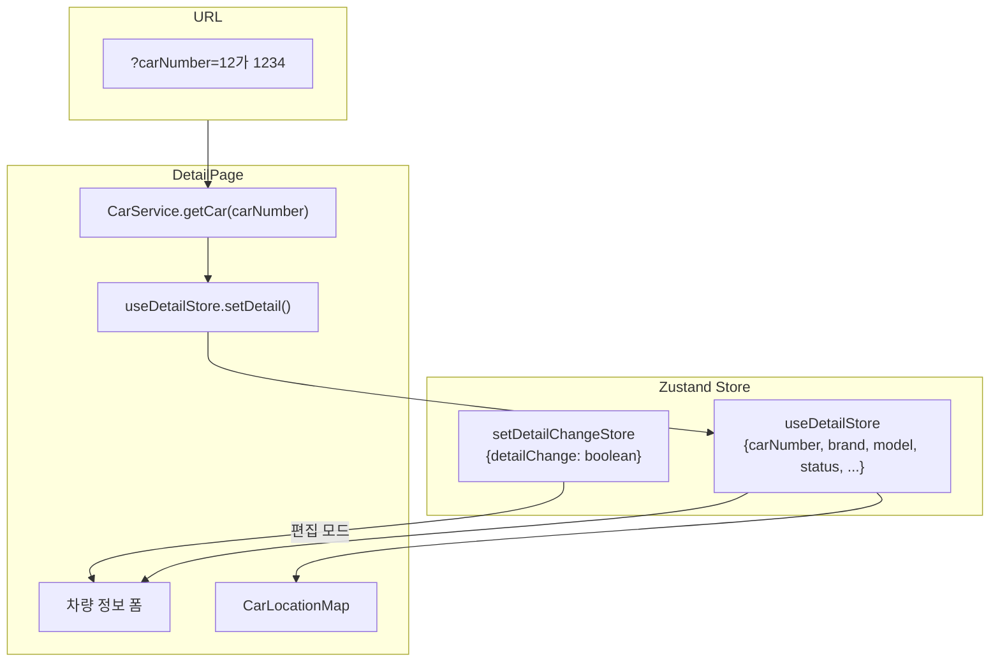
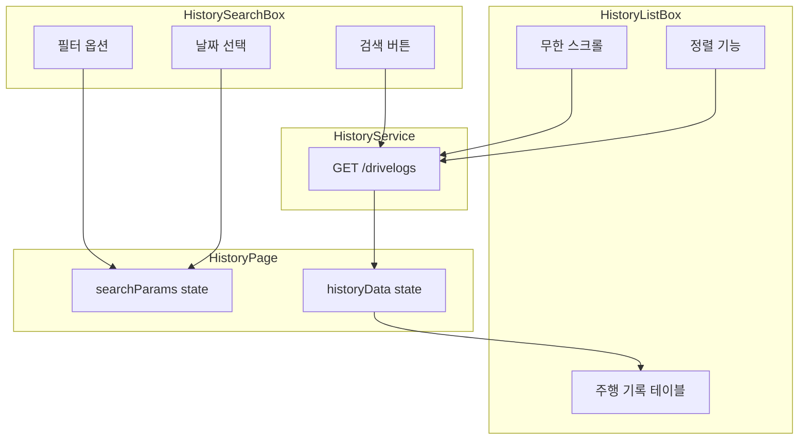
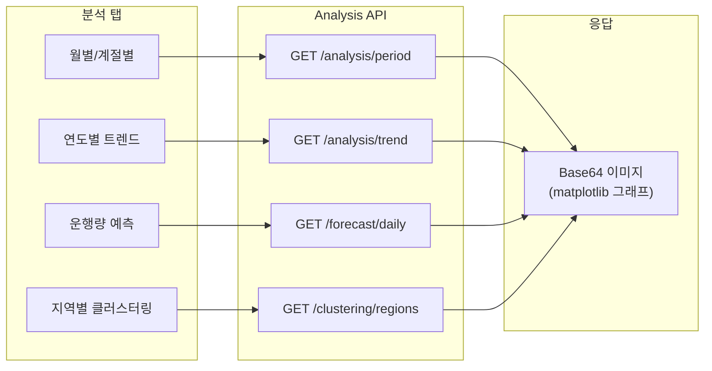
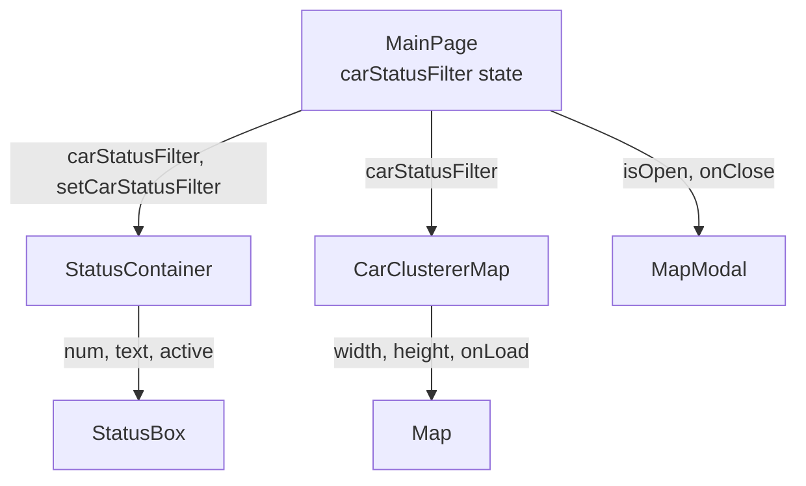
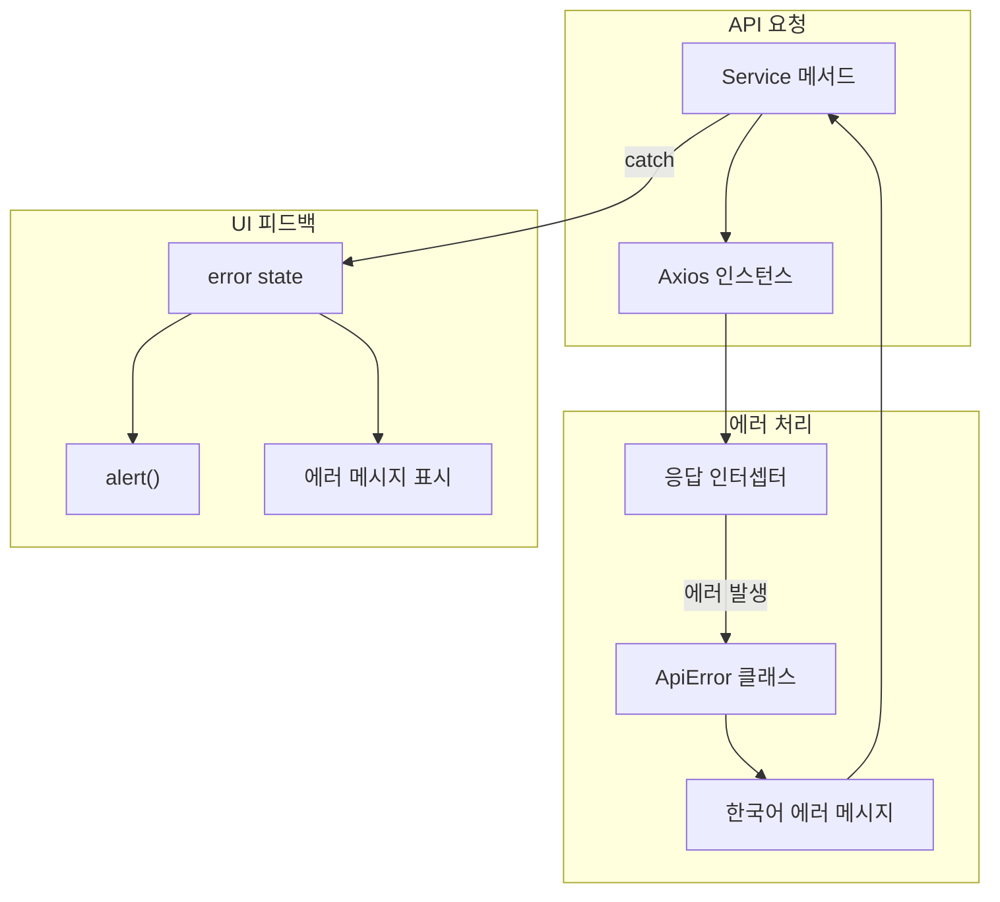

# 데이터 흐름

> 2 the Core 시스템의 데이터 흐름 및 시퀀스 다이어그램

---

## 개요

이 문서는 프론트엔드 애플리케이션 내 주요 데이터 흐름과 백엔드 API와의 통신 패턴을 설명합니다.

---

## 전체 데이터 흐름



---

## 인증 흐름

### 로그인 시퀀스



### 토큰 갱신 시퀀스



---

## 페이지별 데이터 흐름

### 메인 대시보드 (/)



**데이터 흐름:**

1. 페이지 마운트 시 `StatisticsService.getCarStatistics()` 호출
2. `carStatusFilter` 상태로 지도 마커 필터링
3. 3초 간격으로 차량 위치 자동 갱신

**소스 코드:**
- [src/app/page.tsx:8-10](../src/app/page.tsx#L8-L10) - 상태 정의
- [src/components/status-box/status-container.tsx:27-49](../src/components/status-box/status-container.tsx#L27-L49) - 통계 로드

---

### 차량 검색 (/search)



**상태 관리:**

```typescript
// src/components/search-box/search-box.tsx
const [cars, setCars] = useState<Car[]>([]);
const [carNumber, setCarNumber] = useState('');
const [brandModel, setBrandModel] = useState('');
const [status, setStatus] = useState('운행');
const [hasNextPage, setHasNextPage] = useState(true);
```

**소스 코드:**
- [src/components/search-box/search-box.tsx:10-28](../src/components/search-box/search-box.tsx#L10-L28) - 상태 관리
- [src/components/search-box/search-box.tsx:93-142](../src/components/search-box/search-box.tsx#L93-L142) - 검색 로직

---

### 차량 상세 (/detail)



**실시간 갱신:**

```typescript
// src/app/detail/page.tsx:75-90
useEffect(() => {
  // 3초 간격으로 차량 정보 갱신
  const intervalId = setInterval(async () => {
    const updatedCarDetail = await CarService.getCar(urlCarNumber);
    setDetail(updatedCarDetail);
  }, 3000);

  return () => clearInterval(intervalId);
}, [urlCarNumber]);
```

**소스 코드:**
- [src/app/detail/page.tsx:59-73](../src/app/detail/page.tsx#L59-L73) - 초기 데이터 로드
- [src/app/detail/page.tsx:75-90](../src/app/detail/page.tsx#L75-L90) - 실시간 갱신
- [src/store/detail-store.ts](../src/store/detail-store.ts) - Zustand 스토어

---

### 주행 기록 (/history)



**소스 코드:**
- [src/app/history/page.tsx:12-19](../src/app/history/page.tsx#L12-L19) - 상태 관리
- [src/services/history-service.ts:33-63](../src/services/history-service.ts#L33-L63) - API 호출

---

### 데이터 분석 (/analysis)



**소스 코드:**
- [src/app/analysis/page.tsx:194-211](../src/app/analysis/page.tsx#L194-L211) - 월별/계절별 분석
- [src/app/analysis/page.tsx:214-231](../src/app/analysis/page.tsx#L214-L231) - 연도별 트렌드
- [src/app/analysis/page.tsx:234-255](../src/app/analysis/page.tsx#L234-L255) - 운행량 예측
- [src/app/analysis/page.tsx:258-280](../src/app/analysis/page.tsx#L258-L280) - 클러스터링 분석

---

## 컴포넌트 간 데이터 전달

### Props 흐름



### 콜백 패턴

```typescript
// 부모 → 자식: Props로 콜백 전달
<StatusContainer
  carStatusFilter={carStatusFilter}
  setCarStatusFilter={setCarStatusFilter}  // 콜백
/>

// 자식 → 부모: 콜백 호출
onClick={() => setCarStatusFilter('driving')}
```

---

## 에러 처리 흐름



**에러 메시지 매핑:**

```typescript
// src/lib/api.ts:45-58
const getKoreanErrorMessage = (status: number): string => {
  const defaultMessages = {
    400: '잘못된 요청입니다.',
    401: '인증이 필요합니다. 다시 로그인해주세요.',
    403: '접근 권한이 없습니다.',
    404: '요청한 데이터를 찾을 수 없습니다.',
    500: '서버 오류가 발생했습니다.',
  };
  return defaultMessages[status] || '알 수 없는 오류가 발생했습니다.';
};
```

---

## 관련 문서

- [Architecture](Architecture) - 시스템 아키텍처
- [API-Reference](API-Reference) - API 엔드포인트 상세
- [Module-Maps](Module-Maps) - 지도 컴포넌트 데이터 흐름
