# Diagrams (다이어그램 모음)

> 2 the Core 시스템의 시각화 다이어그램 모음

---

## 시스템 아키텍처

### 전체 시스템 구성

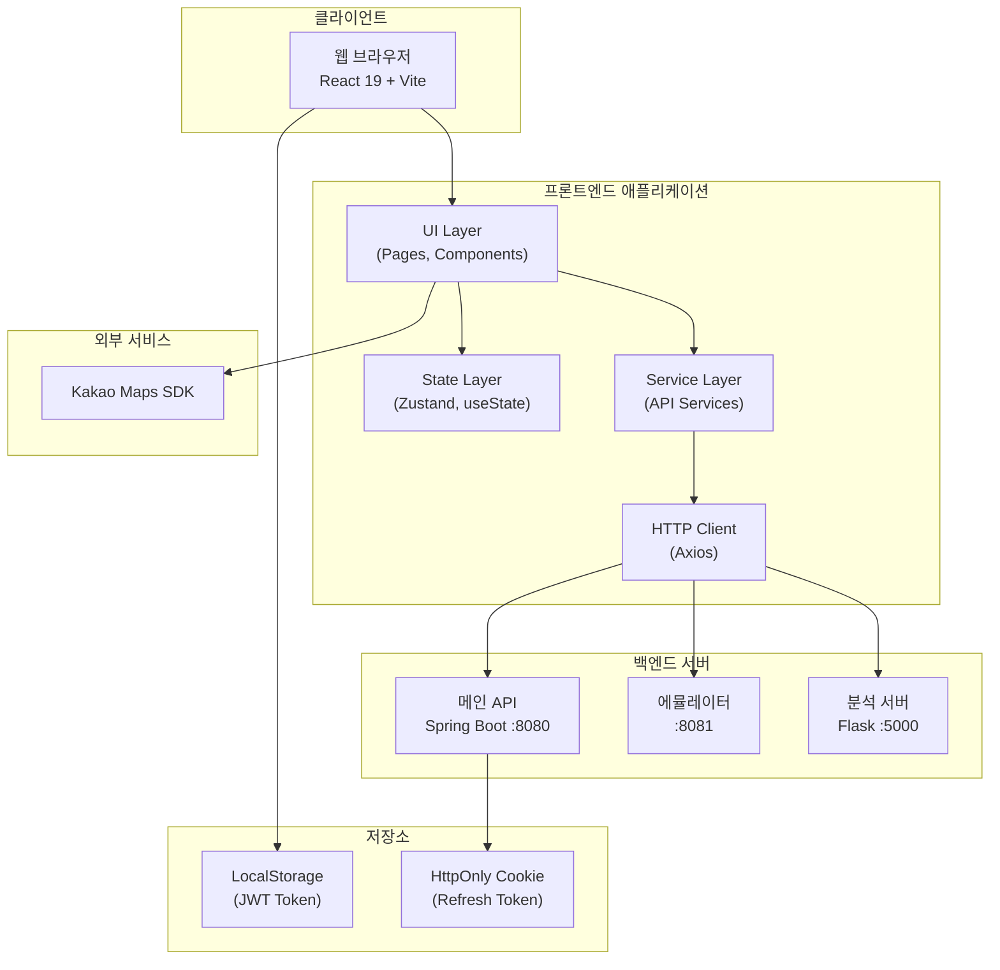

---

## 라우팅 구조

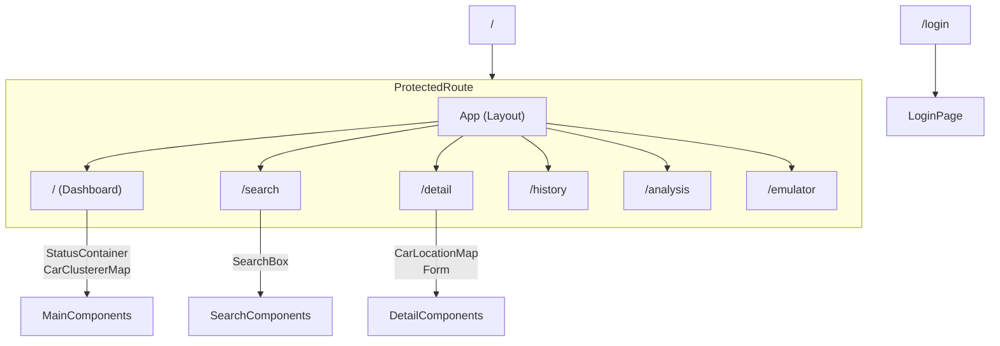

---

## 컴포넌트 계층

### 전체 컴포넌트 트리

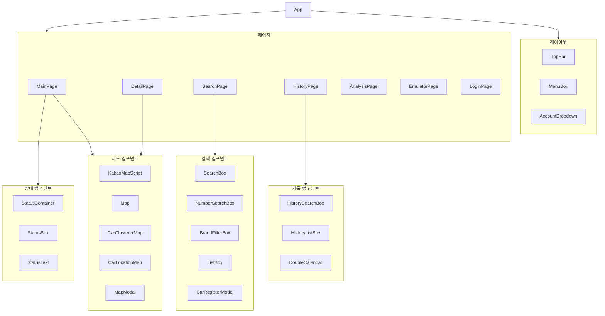

---

## 데이터 흐름

### API 요청 흐름

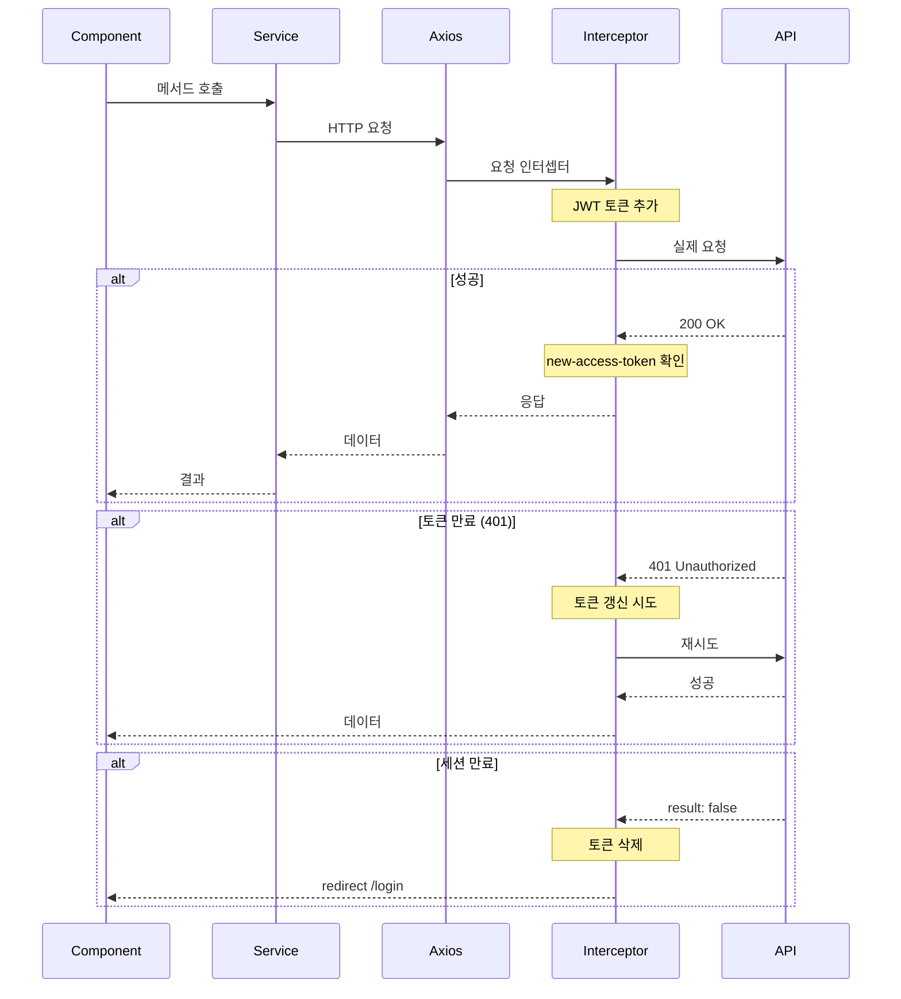

### 상태 업데이트 흐름

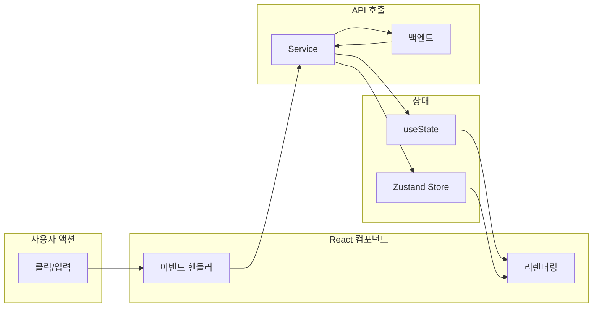

---

## 인증 흐름

### 로그인 시퀀스

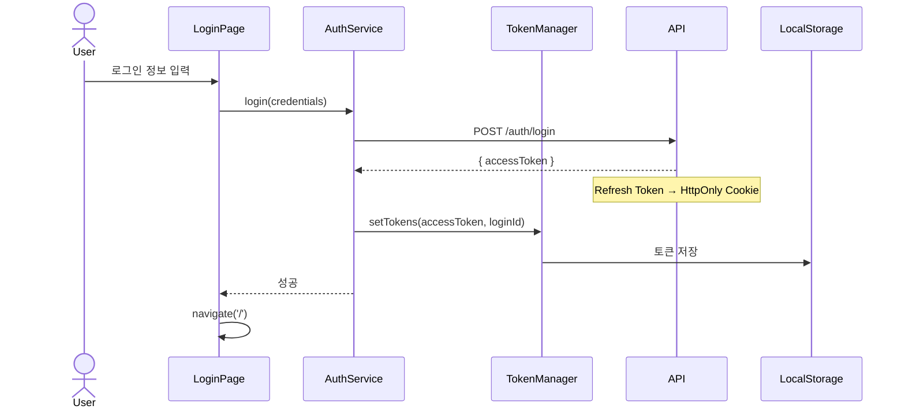

### 토큰 갱신 시퀀스

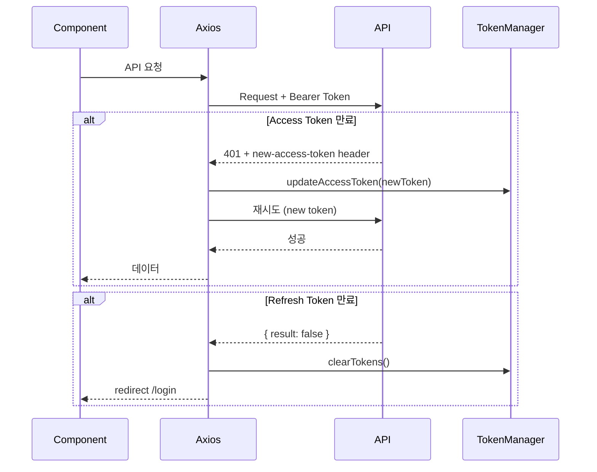

---

## 서비스 클래스 다이어그램

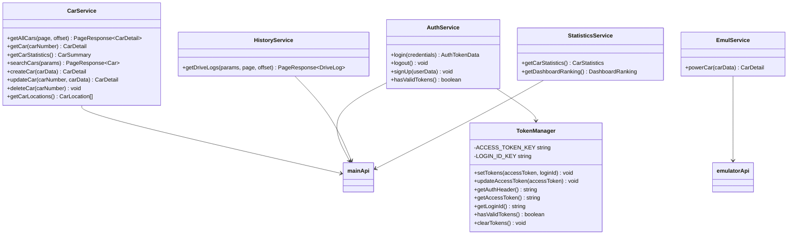

---

## 타입 관계

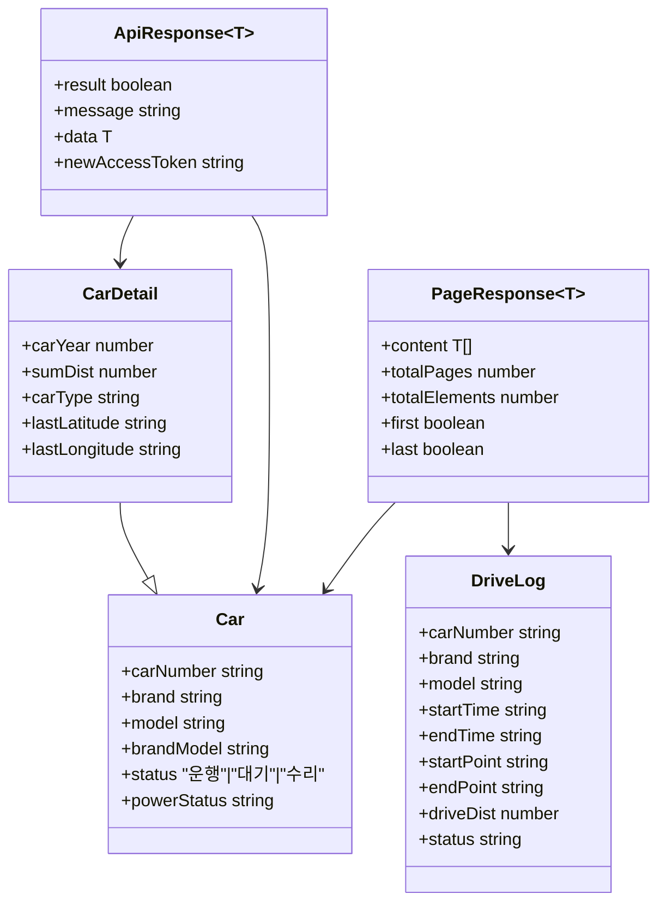

---

## 지도 컴포넌트 흐름

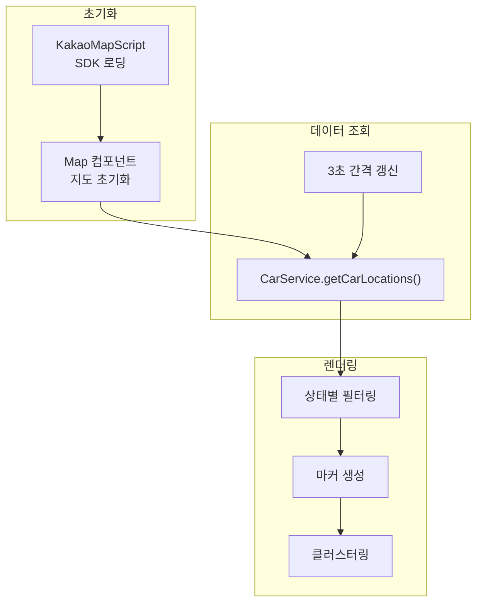

---

## 상태 매핑

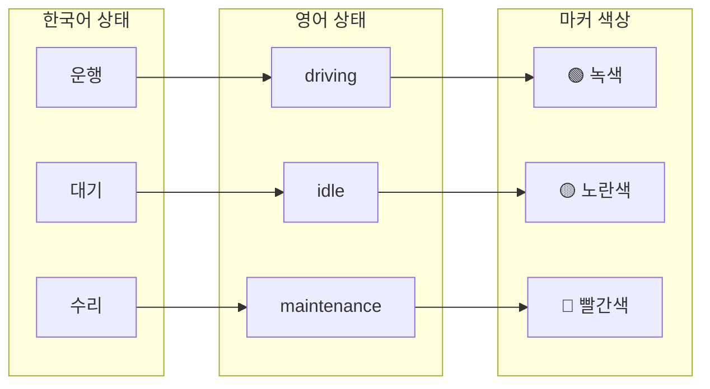

---

## 분석 모듈 흐름

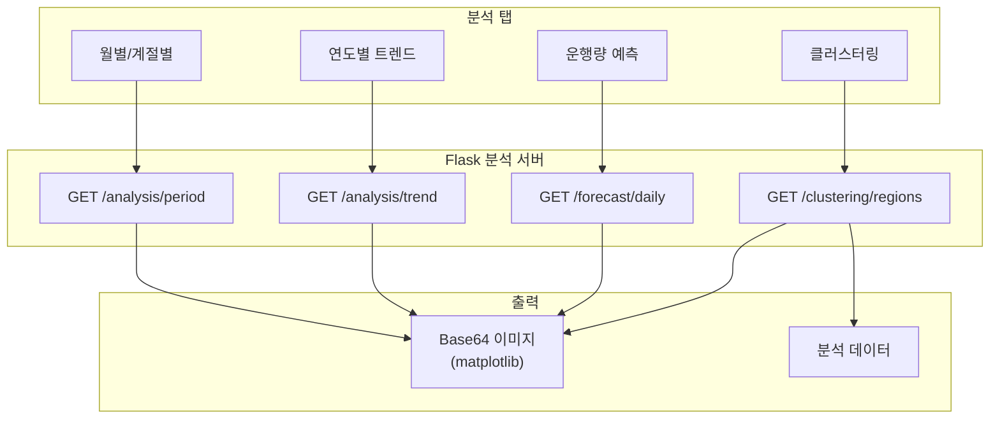

---

## 무한 스크롤 흐름

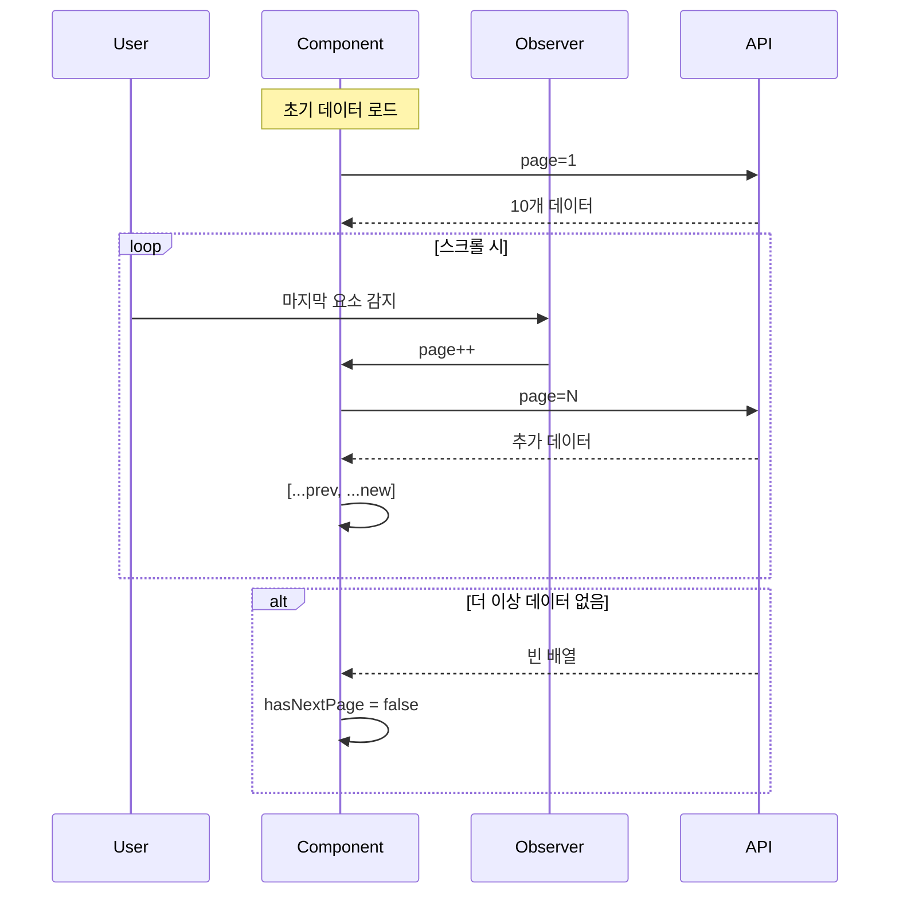

---

## 관련 문서

- [Architecture](Architecture) - 아키텍처 상세
- [Data-Flow](Data-Flow) - 데이터 흐름 상세
- [API-Reference](API-Reference) - API 문서
