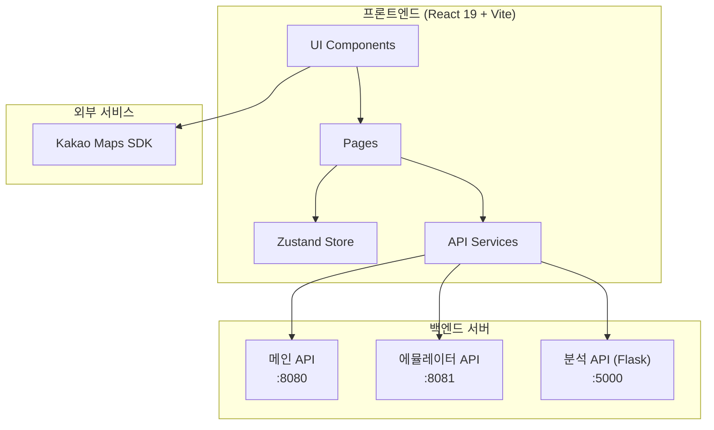

# 2 the Core - 차량 관제 시스템

> **Korean Vehicle Fleet Management System**
> React 19 + Vite 기반의 차량 관제 및 모니터링 시스템

---

## 프로젝트 개요

**2 the Core**는 렌트카 차량의 실시간 위치 추적, 상태 관리, 주행 기록 분석을 위한 웹 기반 관제 시스템입니다.

### 주요 기능

| 기능 | 설명 |
|------|------|
| **실시간 차량 위치 추적** | Kakao Maps 기반 클러스터링 지도로 전체 차량 위치 모니터링 |
| **차량 상태 관리** | 운행/대기/수리 상태별 차량 필터링 및 관리 |
| **주행 기록 조회** | 날짜/차량별 주행 이력 검색 및 조회 |
| **데이터 분석** | 월별/계절별 선호도, 연도별 트렌드, 지역별 클러스터링 분석 |
| **에뮬레이터 제어** | GPS 시뮬레이션을 위한 차량 시동 ON/OFF 제어 |

---

## 아키텍처 개요



---

## 기술 스택

### Frontend
| 기술 | 버전 | 용도 |
|------|------|------|
| [React](https://react.dev/) | 19.1.0 | UI 라이브러리 |
| [Vite](https://vite.dev/) | 6.1.6 | 빌드 도구 |
| [TypeScript](https://www.typescriptlang.org/) | 5.8.3 | 정적 타입 |
| [Tailwind CSS](https://tailwindcss.com/) | 4.1.11 | 스타일링 |
| [Zustand](https://zustand-demo.pmnd.rs/) | 5.0.6 | 상태 관리 |
| [React Router DOM](https://reactrouter.com/) | 7.3.1 | 라우팅 |
| [shadcn/ui](https://ui.shadcn.com/) | - | UI 컴포넌트 |
| [Radix UI](https://www.radix-ui.com/) | - | Headless UI |
| [Kakao Maps SDK](https://apis.map.kakao.com/) | - | 지도 서비스 |

### Backend Integration
- **메인 API**: `http://52.78.122.150:8080/api` - 차량, 인증, 주행 기록
- **에뮬레이터 API**: `http://3.37.93.107:8081/api` - GPS 시뮬레이션
- **분석 API (Flask)**: `http://3.34.194.140:5000/api` - 데이터 분석

---

## 빠른 시작

### 요구 사항
- Node.js 18+
- npm

### 설치 및 실행

```bash
# 저장소 클론
git clone https://github.com/Kernel360/KUNI_2thecore_frontend.git
cd KUNI_2thecore_frontend

# 의존성 설치
npm install

# 개발 서버 실행 (http://localhost:3000)
npm run dev

# 프로덕션 빌드
npm run build
```

### 환경 변수 설정

`.env` 파일을 생성하고 다음 변수를 설정합니다:

```env
VITE_CAR_BASE_URL=http://52.78.122.150:8080/api
VITE_EMULATOR_BASE_URL=http://3.37.93.107:8081/api
VITE_ANALYSIS_API_BASE_URL=http://3.34.194.140:5000/api
```

---

## 페이지 구조

| 경로 | 페이지 | 설명 |
|------|--------|------|
| `/` | [메인 대시보드](Module-Dashboard) | 차량 상태 요약 및 실시간 지도 |
| `/search` | [차량 검색](Module-Search) | 차량 목록 조회 및 필터링 |
| `/detail` | [차량 상세](Module-Detail) | 개별 차량 정보 및 위치 |
| `/history` | [주행 기록](Module-History) | 주행 이력 검색 및 조회 |
| `/analysis` | [데이터 분석](Module-Analysis) | 통계 및 예측 분석 |
| `/emulator` | [에뮬레이터](Module-Emulator) | GPS 시뮬레이션 제어 |
| `/login` | [로그인](Module-Auth) | 사용자 인증 |

---

## 문서 목차

### 아키텍처
- [Architecture](Architecture) - 시스템 구조 및 컴포넌트 관계
- [Data-Flow](Data-Flow) - 데이터 흐름 및 시퀀스 다이어그램
- [Diagrams](Diagrams) - Mermaid 다이어그램 모음

### 모듈 문서
- [Module-Dashboard](Module-Dashboard) - 메인 대시보드
- [Module-Search](Module-Search) - 차량 검색
- [Module-Detail](Module-Detail) - 차량 상세
- [Module-History](Module-History) - 주행 기록
- [Module-Analysis](Module-Analysis) - 데이터 분석
- [Module-Auth](Module-Auth) - 인증 시스템
- [Module-Maps](Module-Maps) - Kakao Maps 통합

### API 문서
- [API-Reference](API-Reference) - 전체 API 엔드포인트 문서

### 가이드
- [Getting-Started](Getting-Started) - 설치 및 시작 가이드
- [Deployment](Deployment) - 배포 가이드

---

## 프로젝트 구조

```
src/
├── app/                    # 페이지 컴포넌트
│   ├── page.tsx           # 메인 대시보드
│   ├── search/            # 차량 검색
│   ├── detail/            # 차량 상세
│   ├── history/           # 주행 기록
│   ├── analysis/          # 데이터 분석
│   ├── emulator/          # 에뮬레이터
│   └── login/             # 로그인
├── components/            # 재사용 컴포넌트
│   ├── map/               # Kakao Maps 컴포넌트
│   ├── search-box/        # 검색 관련 컴포넌트
│   ├── status-box/        # 상태 표시 컴포넌트
│   ├── menu-box/          # 네비게이션 메뉴
│   └── ui/                # shadcn/ui 기본 컴포넌트
├── services/              # API 서비스 레이어
│   ├── car-service.ts     # 차량 CRUD
│   ├── auth-service.ts    # 인증
│   ├── history-service.ts # 주행 기록
│   └── statistics-service.ts # 통계
├── store/                 # Zustand 상태 관리
├── hooks/                 # 커스텀 훅
├── lib/                   # 유틸리티 및 API 설정
└── types/                 # TypeScript 타입 정의
```

---

## 라이센스

이 프로젝트는 Kernel360에서 관리합니다.

---

*Documentation generated with Claude Code Wiki*
