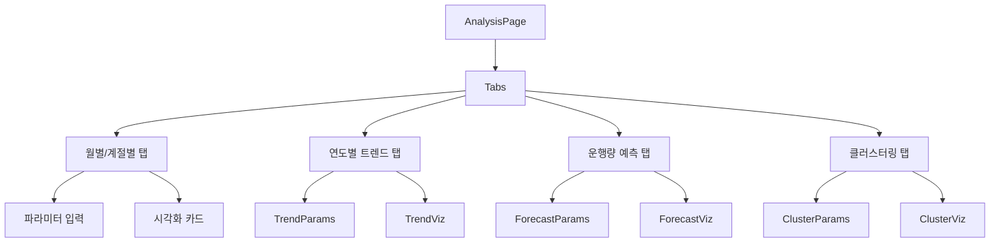

# Module: Analysis (데이터 분석)

> 렌트카 운행 데이터 통계 및 예측 분석

---

## 개요

데이터 분석 페이지는 Flask 기반 분석 서버와 연동하여 다양한 통계 및 예측 분석을 제공합니다.

**경로:** `/analysis`
**파일:** [src/app/analysis/page.tsx](../src/app/analysis/page.tsx)
**API 서버:** `http://3.34.194.140:5000/api`

---

## 분석 유형

| 탭 | API 엔드포인트 | 설명 |
|----|----------------|------|
| 월별/계절별 선호도 | `GET /analysis/period` | 브랜드별 기간 선호도 분석 |
| 연도별 트렌드 | `GET /analysis/trend` | 연도별 시장 트렌드 분석 |
| 운행량 예측 | `GET /forecast/daily` | 일별 운행 차량 수 예측 |
| 지역별 클러스터링 | `GET /clustering/regions` | 수요 집중 지역 분석 |

---

## 컴포넌트 구조



---

## 1. 월별/계절별 선호도 분석

### 파라미터

| 파라미터 | 타입 | 설명 |
|----------|------|------|
| `year` | string | 분석 연도 (예: "2024") |
| `period_type` | `'month' \| 'season'` | 월별 또는 계절별 |

### 시각화 결과

| 키 | 설명 |
|----|------|
| `brand_period_heatmap` | 브랜드별 기간 히트맵 |
| `market_share_pie` | 시장 점유율 파이 차트 |
| `brand_preference_line` | 브랜드 선호도 추이 |
| `seasonality_radar` | 계절성 레이더 차트 |
| `seasonality_strength_bar` | 계절성 강도 바 차트 |
| `statistical_comparison` | 통계 비교 |

### API 호출

```typescript
// src/app/analysis/page.tsx:194-211
const fetchPeriodAnalysis = async () => {
  const response = await analysisApi.get('/analysis/period', {
    params: periodParams,
  });
  setPeriodData(response.data);
};
```

---

## 2. 연도별 트렌드 분석

### 파라미터

| 파라미터 | 타입 | 설명 |
|----------|------|------|
| `start_year` | number | 시작 연도 |
| `end_year` | number | 종료 연도 |
| `top_n` | number | 상위 N개 (기본: 5) |

### 시각화 결과

| 키 | 설명 |
|----|------|
| `brand_trend_lines` | 브랜드별 트렌드 라인 |
| `model_ranking_change` | 모델 순위 변화 |
| `car_age_preference` | 차량 연식별 선호도 |
| `market_share_evolution` | 시장 점유율 변화 |
| `trend_summary` | 트렌드 요약 |

### API 호출

```typescript
// src/app/analysis/page.tsx:214-231
const fetchTrendAnalysis = async () => {
  const response = await analysisApi.get('/analysis/trend', {
    params: trendParams,
  });
  setTrendData(response.data);
};
```

---

## 3. 일별 운행량 예측

### 파라미터

| 파라미터 | 타입 | 설명 |
|----------|------|------|
| `start_date` | Date | 분석 시작일 |
| `end_date` | Date | 분석 종료일 |
| `forecast_days` | number | 예측 일수 (1-30) |

### 시각화 결과

| 키 | 설명 |
|----|------|
| `usage_trend_with_prediction` | 운행 추세 및 예측 |
| `weekday_pattern` | 요일별 패턴 |

### 추가 데이터

```typescript
interface ForecastAnalysisData {
  historical_data?: Array<{
    date: string;
    unique_cars: number;
    total_trips: number;
    total_distance: number;
  }>;
  predictions?: Array<{
    date: string;
    predicted_unique_cars: number;
  }>;
  weekday_patterns?: Record<string, number>;
  model_accuracy?: {
    r2: number;
    mae: number;
  };
}
```

### API 호출

```typescript
// src/app/analysis/page.tsx:234-255
const fetchForecastAnalysis = async () => {
  const response = await analysisApi.get('/forecast/daily', {
    params: {
      start_date: forecastParams.start_date.toISOString().split('T')[0],
      end_date: forecastParams.end_date.toISOString().split('T')[0],
      forecast_days: forecastParams.forecast_days,
    },
  });
  setForecastData(response.data);
};
```

---

## 4. 지역별 클러스터링 분석

### 파라미터

| 파라미터 | 타입 | 설명 |
|----------|------|------|
| `start_date` | Date | 분석 시작일 |
| `end_date` | Date | 분석 종료일 |
| `k` | number | 클러스터 수 |
| `method` | `'kmeans' \| 'dbscan'` | 클러스터링 알고리즘 |

### 시각화 결과

| 키 | 설명 |
|----|------|
| `cluster_map` | 클러스터 지도 |
| `recommendation_map` | 신규 영업소 추천 지역 |

### 클러스터 요약 데이터

```typescript
cluster_summary?: Array<{
  cluster_id: number;
  trip_count: number;
  unique_cars: number;
  avg_distance: number;
  total_distance: number;
  center_lat: number;
  center_lng: number;
  importance_score: number;
}>;
```

### API 호출

```typescript
// src/app/analysis/page.tsx:258-280
const fetchClusterAnalysis = async () => {
  const response = await analysisApi.get('/clustering/regions', {
    params: {
      start_date: clusterParams.start_date.toISOString().split('T')[0],
      end_date: clusterParams.end_date.toISOString().split('T')[0],
      k: clusterParams.k,
      method: clusterParams.method,
    },
  });
  setClusterData(response.data);
};
```

---

## 상태 관리

### 데이터 상태

```typescript
// src/app/analysis/page.tsx:148-155
const [periodData, setPeriodData] = useState<PeriodAnalysisData | null>(null);
const [trendData, setTrendData] = useState<TrendAnalysisData | null>(null);
const [forecastData, setForecastData] = useState<ForecastAnalysisData | null>(null);
const [clusterData, setClusterData] = useState<ClusterAnalysisData | null>(null);
```

### 로딩 상태

```typescript
const [loading, setLoading] = useState({
  period: false,
  trend: false,
  forecast: false,
  cluster: false,
});
```

### 파라미터 상태

```typescript
// 월별/계절별
const [periodParams, setPeriodParams] = useState({
  year: '2024',
  period_type: 'month' as 'month' | 'season',
});

// 연도별 트렌드
const [trendParams, setTrendParams] = useState({
  start_year: 2020,
  end_year: 2024,
  top_n: 5,
});

// 일별 예측
const [forecastParams, setForecastParams] = useState({
  start_date: new Date('2024-01-01'),
  end_date: new Date('2024-01-31'),
  forecast_days: 7,
});

// 클러스터링
const [clusterParams, setClusterParams] = useState({
  start_date: new Date('2024-01-01'),
  end_date: new Date('2024-12-31'),
  k: 5,
  method: 'kmeans' as 'kmeans' | 'dbscan',
});
```

---

## 시각화 렌더링

Flask 서버는 matplotlib으로 생성된 차트를 Base64 이미지로 반환합니다.

```typescript
// src/app/analysis/page.tsx:287-314
const renderVisualization = (
  key: keyof typeof visualizationTitles,
  base64Data?: string
) => {
  if (!base64Data) return null;

  return (
    <Card key={key}>
      <CardHeader>
        <CardTitle>{visualizationTitles[key]}</CardTitle>
        <CardDescription>{visualizationDescriptions[key]}</CardDescription>
      </CardHeader>
      <CardContent>
        
      </CardContent>
    </Card>
  );
};
```

---

## 시각화 제목/설명

```typescript
// src/app/analysis/page.tsx:96-143
const visualizationTitles = {
  brand_period_heatmap: '브랜드별 기간 히트맵',
  market_share_pie: '시장 점유율',
  brand_preference_line: '브랜드 선호도 추이',
  // ...
};

const visualizationDescriptions = {
  brand_period_heatmap: '각 브랜드의 기간별 선호도를 히트맵으로 표현',
  market_share_pie: '렌트카 브랜드별 시장 점유율 현황',
  // ...
};
```

---

## Flask API 클라이언트

Flask 서버용 별도 Axios 인스턴스 사용:

```typescript
// src/lib/api.ts:180-208
const createFlaskApiInstance = (baseURL: string): AxiosInstance => {
  const instance = axios.create({
    baseURL,
    timeout: 10000,
    headers: { 'Content-Type': 'application/json' },
    withCredentials: false,  // JWT 없이 호출
  });
  return instance;
};

export const analysisApi = createFlaskApiInstance(ANALYSIS_API_BASE_URL);
```

---

## UI 컴포넌트 사용

- `Tabs`, `TabsContent`, `TabsList`, `TabsTrigger` - 탭 UI
- `Card`, `CardContent`, `CardHeader` - 시각화 카드
- `Input`, `Select`, `Button` - 파라미터 입력
- `DoubleCalendar` - 날짜 범위 선택
- `Loader2` - 로딩 스피너

---

## 에러 처리

```typescript
// API 호출 실패 시
catch (error) {
  setPeriodData({
    success: false,
    message: error instanceof Error ? error.message : '분석 실패',
    visualizations: {},
  });
}
```

---

## 관련 문서

- [API-Reference](API-Reference) - 분석 API
- [Architecture](Architecture) - Flask 서버 연동
