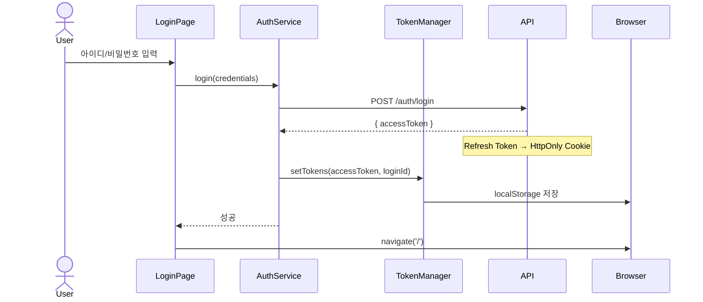

# Module: Auth (인증 시스템)

> 로그인, 로그아웃, 회원가입 및 JWT 토큰 관리

---

## 개요

인증 모듈은 JWT 기반 사용자 인증을 처리합니다. Access Token은 localStorage에, Refresh Token은 HttpOnly 쿠키로 관리됩니다.

---

## 구성 요소

| 파일 | 역할 |
|------|------|
| [src/app/login/page.tsx](../src/app/login/page.tsx) | 로그인 페이지 |
| [src/services/auth-service.ts](../src/services/auth-service.ts) | 인증 API 서비스 |
| [src/lib/token-manager.ts](../src/lib/token-manager.ts) | JWT 토큰 관리 |
| [src/components/ProtectedRoute.tsx](../src/components/ProtectedRoute.tsx) | 라우트 보호 |
| [src/components/signup-modal.tsx](../src/components/signup-modal.tsx) | 회원가입 모달 |

---

## 로그인 페이지

**경로:** `/login`
**파일:** [src/app/login/page.tsx](../src/app/login/page.tsx)

### 스크린샷

```
┌─────────────────────────────────────────────────────────┐
│  [Logo]  2 the Core                         로그인      │
├─────────────────────────────────────────────────────────┤
│                                                         │
│           ┌─────────────────────────────┐               │
│           │         로그인              │  [회원가입]   │
│           │  아이디와 비밀번호를 입력    │               │
│           │                             │               │
│           │  아이디                     │               │
│           │  [                        ] │               │
│           │                             │               │
│           │  비밀번호                   │               │
│           │  [                        ] │               │
│           │                             │               │
│           │        [로그인]             │               │
│           │                             │               │
│           │  문의: 2the@core.com        │               │
│           └─────────────────────────────┘               │
│                                                         │
└─────────────────────────────────────────────────────────┘
```

### 로그인 흐름



### 상태 관리

```typescript
// src/app/login/page.tsx:19-27
const [credentials, setCredentials] = useState({
  loginId: '',
  password: '',
});
const [loading, setLoading] = useState(false);
const [error, setError] = useState('');
const [isModalOpen, setIsModalOpen] = useState(false);
```

### 로그인 핸들러

```typescript
// src/app/login/page.tsx:37-56
const handleSubmit = async (e: React.FormEvent) => {
  e.preventDefault();

  if (!credentials.loginId || !credentials.password) {
    setError('아이디와 비밀번호를 입력해주세요.');
    return;
  }

  setLoading(true);
  try {
    await AuthService.login(credentials);
    navigate('/');
  } catch (error: any) {
    setError(error.message || '로그인에 실패했습니다.');
  } finally {
    setLoading(false);
  }
};
```

---

## AuthService

**파일:** [src/services/auth-service.ts](../src/services/auth-service.ts)

### 타입 정의

```typescript
interface LoginRequest {
  loginId: string;
  password: string;
}

interface SignUpRequest {
  loginId: string;
  password: string;
  name: string;
  email: string;
  birthdate: string;
  phoneNumber: string;
}

interface AuthTokenData {
  accessToken: string;
}
```

### 메서드

#### login

```typescript
// src/services/auth-service.ts:48-65
static async login(credentials: LoginRequest): Promise<AuthTokenData> {
  const response = await mainApi.post('/auth/login', credentials);

  if (response.data.result && response.data.data) {
    TokenManager.setTokens(
      response.data.data.accessToken,
      credentials.loginId
    );
    return response.data.data;
  } else {
    throw new Error(response.data.message || '로그인에 실패했습니다.');
  }
}
```

#### logout

```typescript
// src/services/auth-service.ts:68-79
static async logout(): Promise<void> {
  try {
    await mainApi.post('/auth/logout');
  } catch (error) {
    console.warn('서버 로그아웃 실패:', error);
  } finally {
    TokenManager.clearTokens();
  }
}
```

#### signUp

```typescript
// src/services/auth-service.ts:87-96
static async signUp(userData: SignUpRequest): Promise<void> {
  const response = await mainApi.post('/admin/signup', userData);

  if (!response.data.result) {
    throw new Error(response.data.message || '회원가입에 실패했습니다.');
  }
}
```

#### hasValidTokens

```typescript
// src/services/auth-service.ts:82-84
static hasValidTokens(): boolean {
  return TokenManager.hasValidTokens();
}
```

---

## TokenManager

**파일:** [src/lib/token-manager.ts](../src/lib/token-manager.ts)

### 토큰 저장 구조

| 토큰 | 저장 위치 | 유효 기간 |
|------|-----------|-----------|
| Access Token | localStorage | 10분 |
| Refresh Token | HttpOnly Cookie | 7일 |

### 메서드

```typescript
export class TokenManager {
  private static readonly ACCESS_TOKEN_KEY = 'accessToken';
  private static readonly LOGIN_ID_KEY = 'loginId';

  // 로그인 시 토큰 저장
  static setTokens(accessToken: string, loginId: string): void {
    localStorage.setItem(this.ACCESS_TOKEN_KEY, accessToken);
    localStorage.setItem(this.LOGIN_ID_KEY, loginId);
  }

  // 토큰 갱신
  static updateAccessToken(accessToken: string): void {
    localStorage.setItem('accessToken', accessToken);
  }

  // Authorization 헤더 생성
  static getAuthHeader(): string | null {
    const token = this.getAccessToken();
    return token ? `Bearer ${token}` : null;
  }

  // Access Token 조회
  static getAccessToken(): string | null {
    return localStorage.getItem(this.ACCESS_TOKEN_KEY);
  }

  // Login ID 조회
  static getLoginId(): string | null {
    return localStorage.getItem(this.LOGIN_ID_KEY);
  }

  // 인증 상태 확인
  static hasValidTokens(): boolean {
    return this.getAccessToken() !== null;
  }

  // 로그아웃 (토큰 삭제)
  static clearTokens(): void {
    localStorage.removeItem(this.ACCESS_TOKEN_KEY);
    localStorage.removeItem(this.LOGIN_ID_KEY);
  }
}
```

---

## ProtectedRoute

**파일:** [src/components/ProtectedRoute.tsx](../src/components/ProtectedRoute.tsx)

인증된 사용자만 접근할 수 있도록 라우트를 보호합니다.

```typescript
interface ProtectedRouteProps {
  children: React.ReactNode;
}

export default function ProtectedRoute({ children }: ProtectedRouteProps) {
  const [loading, setLoading] = useState(true);
  const navigate = useNavigate();

  useEffect(() => {
    const checkAuth = async () => {
      if (!TokenManager.hasValidTokens()) {
        navigate('/login');
        return;
      }

      try {
        const isValid = await TokenManager.hasValidTokens();
        if (isValid) {
          setLoading(false);
        } else {
          navigate('/login');
        }
      } catch (error) {
        navigate('/login');
      }
    };

    checkAuth();
  }, [navigate]);

  if (loading) {
    return <div>로딩중...</div>;
  }

  return <>{children}</>;
}
```

### 라우팅 설정

```typescript
// src/main.tsx
<Routes>
  {/* 로그인 페이지 - 보호되지 않음 */}
  <Route path="/login" element={<LoginPage />} />

  {/* 보호된 라우트들 */}
  <Route
    path="/"
    element={
      <ProtectedRoute>
        <App />
      </ProtectedRoute>
    }
  >
    <Route index element={<MainPage />} />
    <Route path="detail" element={<DetailPage />} />
    {/* ... */}
  </Route>
</Routes>
```

---

## 토큰 자동 갱신

Axios 인터셉터에서 자동으로 처리됩니다.

```typescript
// src/lib/api.ts:93-169
instance.interceptors.response.use(
  (response) => {
    // 새 Access Token이 응답 헤더에 있으면 업데이트
    if (response.headers['new-access-token']) {
      TokenManager.updateAccessToken(response.headers['new-access-token']);
    }
    return response;
  },
  async (error) => {
    // 401 에러 시 토큰 갱신 시도
    if (error.response?.status === 401) {
      if (error.response?.headers['new-access-token']) {
        const newToken = error.response.headers['new-access-token'];
        TokenManager.updateAccessToken(newToken);

        // 원래 요청 재시도
        const originalRequest = error.config;
        originalRequest.headers.Authorization = `Bearer ${newToken}`;
        return instance.request(originalRequest);
      }

      // 3회 실패 시 로그아웃
      TokenManager.clearTokens();
      window.location.href = '/login';
    }
    return Promise.reject(error);
  }
);
```

---

## 회원가입 모달

**파일:** [src/components/signup-modal.tsx](../src/components/signup-modal.tsx)

```typescript
interface SignUpData {
  loginId: string;
  password: string;
  name: string;
  email: string;
  birthdate: string;
  phoneNumber: string;
}
```

### 회원가입 핸들러

```typescript
// src/app/login/page.tsx:58-80
const handleSignUp = async (formData: SignUpData) => {
  try {
    await AuthService.signUp({
      loginId: formData.loginId,
      password: formData.password,
      name: formData.name,
      email: formData.email,
      birthdate: formData.birthdate,
      phoneNumber: formData.phoneNumber,
    });
    setIsModalOpen(false);
    alert('가입 신청서가 제출되었습니다.');
  } catch (error: any) {
    setError(error.message || '회원가입에 실패했습니다.');
  }
};
```

---

## 로그아웃 (AccountDropdown)

**파일:** [src/components/user-box.tsx](../src/components/user-box.tsx)

```typescript
const handleLogout = async () => {
  await AuthService.logout();
  navigate('/login');
};
```

---

## 에러 처리

한국어 에러 메시지:

| 상태 코드 | 메시지 |
|-----------|--------|
| 401 | 인증이 필요합니다. 다시 로그인해주세요. |
| 403 | 접근 권한이 없습니다. |

---

## 관련 문서

- [Architecture](Architecture) - 인증 아키텍처
- [Data-Flow](Data-Flow) - 인증 흐름
- [API-Reference](API-Reference) - 인증 API
