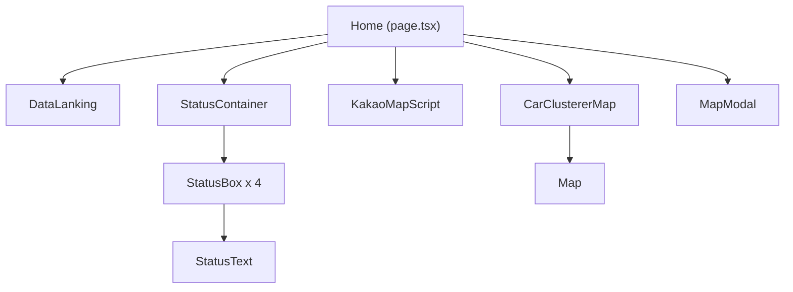
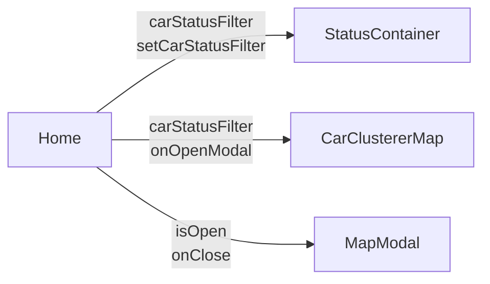

# Module: Dashboard (메인 대시보드)

> 차량 관제 시스템의 중앙 허브 - 실시간 차량 모니터링 및 상태 요약

---

## 개요

메인 대시보드는 전체 차량의 실시간 위치와 상태를 한눈에 파악할 수 있는 관제 센터입니다.

**경로:** `/`
**파일:** [src/app/page.tsx](../src/app/page.tsx)

---

## 스크린샷

```
┌─────────────────────────────────────────────────────────┐
│  [TopBar]  2 the Core                    [AccountMenu]  │
│  ───────────────────────────────────────────────────────│
│  [DataLanking] 인기 모델 | 인기 지역 | 인기 차급         │
├─────────────────────────────────────────────────────────┤
│  ┌───────────┐  ┌─────────────────────────────────────┐ │
│  │ 전체 차량 │  │                                     │ │
│  │    150    │  │                                     │ │
│  ├───────────┤  │         Kakao Maps                  │ │
│  │ 운행 중   │  │     (클러스터 마커 표시)              │ │
│  │    80     │  │                                     │ │
│  ├───────────┤  │    🚗 🚗 🚗                          │ │
│  │ 대기 중   │  │                                     │ │
│  │    50     │  │                                     │ │
│  ├───────────┤  │                                     │ │
│  │ 수리 중   │  │                         [전체화면]  │ │
│  │    20     │  │                                     │ │
│  └───────────┘  └─────────────────────────────────────┘ │
└─────────────────────────────────────────────────────────┘
```

---

## 컴포넌트 구조



---

## 주요 기능

### 1. 차량 상태 요약

4개의 상태 박스로 전체 차량 현황을 표시합니다.

| 상태 | 필터 값 | 아이콘 색상 |
|------|---------|-------------|
| 전체 차량 | `total` | - |
| 운행 중 | `driving` | 🟢 녹색 |
| 대기 중 | `idle` | 🟡 노란색 |
| 수리 중 | `maintenance` | 🔴 빨간색 |

**클릭 시 해당 상태의 차량만 지도에 표시됩니다.**

### 2. 실시간 지도

- Kakao Maps SDK 기반 클러스터링 지도
- 3초 간격 자동 갱신
- 마커 클릭 시 줌인 애니메이션
- 전체화면 모드 지원

### 3. 데이터 랭킹

- 인기 차량 모델 TOP 3
- 인기 지역 TOP 3
- 인기 차급 TOP 3

---

## 상태 관리

### 로컬 상태

```typescript
// src/app/page.tsx:8-13
const [carStatusFilter, setCarStatusFilter] = useState<
  'total' | 'driving' | 'maintenance' | 'idle'
>('total');

const [isMapModalOpen, setIsMapModalOpen] = useState(false);
```

| 상태 | 타입 | 설명 |
|------|------|------|
| `carStatusFilter` | `'total' \| 'driving' \| 'maintenance' \| 'idle'` | 지도 마커 필터 |
| `isMapModalOpen` | `boolean` | 지도 모달 표시 여부 |

---

## Props 흐름



---

## API 호출

### StatisticsService.getCarStatistics()

**호출 위치:** [StatusContainer](../src/components/status-box/status-container.tsx)

```typescript
// src/components/status-box/status-container.tsx:28-48
useEffect(() => {
  const fetchCarStatistics = async () => {
    const statistics = await StatisticsService.getCarStatistics();
    setCarSummary(statistics);
  };
  fetchCarStatistics();
}, []);
```

### StatisticsService.getDashboardRanking()

**호출 위치:** [DataLanking](../src/components/data-lanking/data-lanking.tsx)

---

## 컴포넌트 상세

### StatusContainer

**파일:** [src/components/status-box/status-container.tsx](../src/components/status-box/status-container.tsx)

```typescript
interface StatusContainerProps {
  carStatusFilter: 'total' | 'driving' | 'maintenance' | 'idle';
  setCarStatusFilter: (status: ...) => void;
}
```

**역할:**
- 차량 통계 데이터 로드
- 4개의 StatusBox 렌더링
- 클릭 이벤트로 필터 변경

### CarClustererMap

**파일:** [src/components/map/car-clusterer-map.tsx](../src/components/map/car-clusterer-map.tsx)

```typescript
interface CarClustererMapProps {
  width: string;
  height: string;
  carStatusFilter: 'total' | 'driving' | 'maintenance' | 'idle';
  onOpenModal?: () => void;
  isMapModalOpen?: boolean;
}
```

**역할:**
- Kakao Maps 마커 클러스터링
- 필터에 따른 마커 표시
- 클러스터/마커 클릭 이벤트

---

## 마커 아이콘

| 상태 | 이미지 파일 |
|------|-------------|
| 운행 중 (driving) | `/car_green.png` |
| 대기 중 (idle) | `/car_yellow.png` |
| 수리 중 (maintenance) | `/car_red.png` |

**참조:** [src/components/map/car-clusterer-map.tsx:83-87](../src/components/map/car-clusterer-map.tsx#L83-L87)

---

## 사용 예시

```tsx
// 메인 페이지 구현
export default function Home() {
  const [carStatusFilter, setCarStatusFilter] = useState<
    'total' | 'driving' | 'maintenance' | 'idle'
  >('total');

  return (
    <div className="flex flex-col">
      <DataLanking />
      <div className="flex flex-row gap-6">
        <StatusContainer
          carStatusFilter={carStatusFilter}
          setCarStatusFilter={setCarStatusFilter}
        />
        <KakaoMapScript />
        <CarClustererMap
          width="100%"
          height="100%"
          carStatusFilter={carStatusFilter}
        />
      </div>
    </div>
  );
}
```

---

## 관련 문서

- [Module-Maps](Module-Maps) - Kakao Maps 컴포넌트 상세
- [Data-Flow](Data-Flow) - 데이터 흐름
- [API-Reference](API-Reference) - 통계 API
