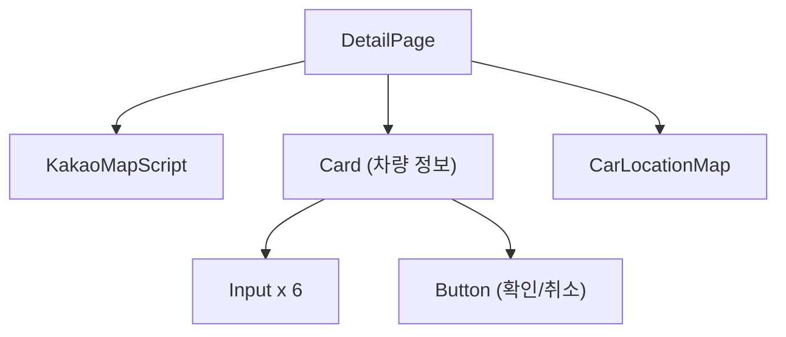
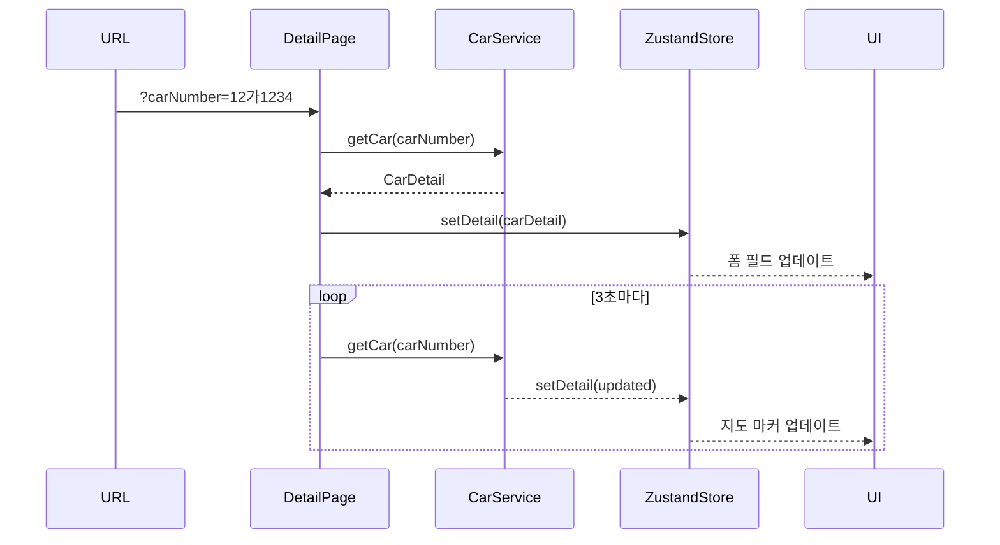

# Module: Detail (차량 상세)

> 개별 차량의 상세 정보 조회 및 수정

---

## 개요

차량 상세 페이지는 특정 차량의 상세 정보와 실시간 위치를 표시합니다.

**경로:** `/detail?carNumber={carNumber}`
**파일:** [src/app/detail/page.tsx](../src/app/detail/page.tsx)

---

## 스크린샷

```
┌─────────────────────────────────────────────────────────┐
│  [TopBar]  2 the Core                    [AccountMenu]  │
│  ───────────────────────────────────────────────────────│
│  [차량 검색] [주행 기록] [데이터 분석] [에뮬레이터]       │
├─────────────────────────────────────────────────────────┤
│  ┌─────────────────┐  ┌─────────────────────────────────┤
│  │ [←] 차량 정보   │  │                                 │
│  │                 │  │                                 │
│  │ 차량 번호       │  │        Kakao Maps               │
│  │ [12가 1234    ] │  │     (개별 차량 위치)             │
│  │                 │  │                                 │
│  │ 차량 브랜드 이름 │  │         📍                      │
│  │ [현대 아반떼   ]│  │                                 │
│  │                 │  │                                 │
│  │ 상태           │  │                                 │
│  │ [운행         ]│  │                                 │
│  │                 │  │                                 │
│  │ 차량 연식      │  │                                 │
│  │ [2023         ]│  │                                 │
│  │                 │  │                                 │
│  │ 주행 거리 (km) │  │                                 │
│  │ [15000.50     ]│  │                                 │
│  │                 │  │                                 │
│  │ 차급           │  │                                 │
│  │ [중형         ]│  │                                 │
│  │                 │  │                                 │
│  │ [확인] [취소]   │  │                                 │
│  └─────────────────┘  └─────────────────────────────────┘
└─────────────────────────────────────────────────────────┘
```

---

## 컴포넌트 구조



---

## 주요 기능

### 1. 차량 정보 표시

| 필드 | 상태 키 | 편집 가능 |
|------|---------|-----------|
| 차량 번호 | `carNumber` | ❌ |
| 브랜드 이름 | `brandModel` | ✅ |
| 상태 | `status` | ✅ |
| 차량 연식 | `carYear` | ✅ |
| 주행 거리 | `sumDist` | ✅ |
| 차급 | `carType` | ✅ |

### 2. 실시간 위치 갱신

3초 간격으로 차량 위치를 자동 갱신합니다.

```typescript
// src/app/detail/page.tsx:75-90
useEffect(() => {
  const intervalId = setInterval(async () => {
    const updatedCarDetail = await CarService.getCar(urlCarNumber);
    setDetail(updatedCarDetail);
  }, 3000);

  return () => clearInterval(intervalId);
}, [urlCarNumber]);
```

### 3. 편집 모드

Zustand 스토어의 `detailChange` 상태로 편집 모드를 제어합니다.

---

## 상태 관리

### Zustand Store

#### useDetailStore

**파일:** [src/store/detail-store.ts](../src/store/detail-store.ts)

```typescript
type DetailStore = CarDetail & {
  setDetail: (detail: CarDetail) => void;
};

export const useDetailStore = create<DetailStore>(set => ({
  carNumber: '',
  brand: '',
  model: '',
  brandModel: '',
  status: '' as '운행' | '대기' | '수리',
  lastLatitude: '',
  lastLongitude: '',
  carYear: 0,
  sumDist: 0,
  carType: '',
  setDetail: detail => set({
    ...detail,
    brandModel: `${detail.brand} ${detail.model}`,
    sumDist: detail.sumDist ? Number(detail.sumDist.toFixed(2)) : 0
  }),
}));
```

#### setDetailChangeStore

**파일:** [src/store/detail-change.ts](../src/store/detail-change.ts)

```typescript
interface DetailChangeStore {
  detailChange: boolean;
  setDetailChange: (value: boolean) => void;
}
```

### 컴포넌트 상태 사용

```typescript
// src/app/detail/page.tsx:20-35
const {
  carNumber, brand, model, status,
  carYear, sumDist, carType,
  setDetail, brandModel,
  lastLatitude, lastLongitude,
} = useDetailStore();

const detailChange = setDetailChangeStore(state => state.detailChange);
const setDetailChange = setDetailChangeStore(state => state.setDetailChange);
```

---

## 데이터 흐름



---

## API 호출

### 초기 데이터 로드

```typescript
// src/app/detail/page.tsx:59-73
useEffect(() => {
  if (urlCarNumber) {
    const fetchCarDetail = async () => {
      const carDetail = await CarService.getCar(urlCarNumber);
      setDetail(carDetail);
    };
    fetchCarDetail();
  }
}, [urlCarNumber]);
```

### 차량 정보 저장

```typescript
// src/app/detail/page.tsx:122-154
const handleSave = async () => {
  let [finalBrand, finalModel] = brandModel.split(' ');

  const updateData: Partial<CarDetail> = {
    brand: finalBrand,
    model: finalModel,
    status,
    carYear,
    sumDist,
    carType,
  };

  await CarService.updateCar(carNumber, updateData);
  setDetailChange(false);
  navigate('/search');
};
```

---

## 필드 수정 핸들러

```typescript
// src/app/detail/page.tsx:92-120
const handleChange = (
  field: 'brandModel' | keyof CarDetail,
  value: string
) => {
  if (field === 'brandModel') {
    setDetail({
      carNumber, brand, brandModel: value, model, status,
      carYear, sumDist, carType,
    });
  } else {
    setDetail({
      carNumber, brand, brandModel, model, status,
      carYear, sumDist, carType,
      [field]: value,
    });
  }
};
```

---

## 상태 변환

한국어 상태를 영어로 매핑하여 지도 컴포넌트에 전달합니다.

```typescript
// src/app/detail/page.tsx:44-56
const getEnglishStatus = (
  koreanStatus: string
): 'driving' | 'maintenance' | 'idle' => {
  switch (koreanStatus) {
    case '운행': return 'driving';
    case '수리': return 'maintenance';
    case '대기':
    default: return 'idle';
  }
};
```

---

## CarLocationMap

**파일:** [src/components/map/car-location-map.tsx](../src/components/map/car-location-map.tsx)

```typescript
<CarLocationMap
  width="100%"
  height="100%"
  carNumber={carNumber}
  lastLatitude={lastLatitude}
  lastLongitude={lastLongitude}
  status={getEnglishStatus(safeStatus)}
/>
```

---

## 네비게이션

### 뒤로 가기

```typescript
// src/app/detail/page.tsx:36-38
const goBack = useCallback(() => {
  window.history.back();
}, []);
```

### 저장 후 이동

```typescript
navigate('/search');
```

---

## 스타일

**파일:** [src/app/detail/detail.module.css](../src/app/detail/detail.module.css)

주요 클래스:
- `.contentGrid` - 2컬럼 그리드 레이아웃
- `.detailCard` - 정보 카드 스타일
- `.mapCard` - 지도 카드 스타일
- `.formGrid` - 폼 그리드
- `.buttonContainer` - 버튼 컨테이너

---

## 편집 모드 진입

검색 페이지의 ListBox에서 편집 버튼 클릭 시:

```typescript
// ListBox 컴포넌트에서
setDetailChange(true);
navigate(`/detail?carNumber=${carNumber}`);
```

---

## 관련 문서

- [Module-Search](Module-Search) - 차량 검색 페이지
- [Module-Maps](Module-Maps) - 지도 컴포넌트
- [API-Reference](API-Reference) - 차량 API
