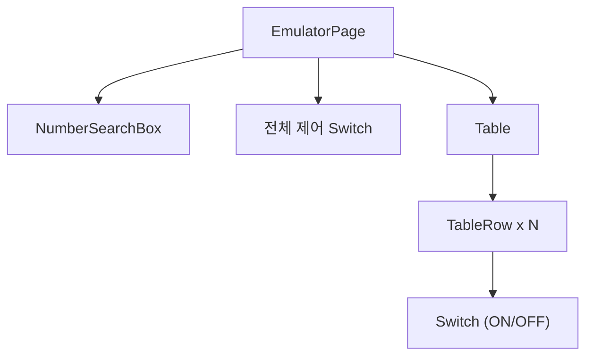
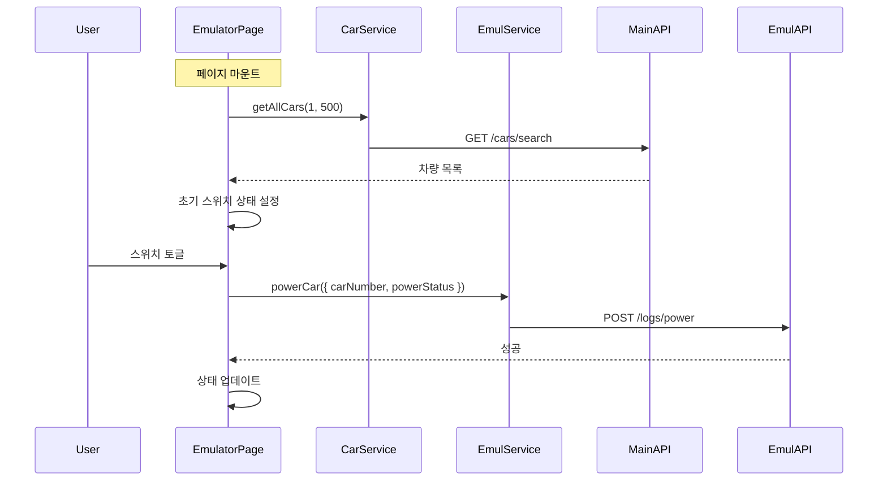

# Module: Emulator (에뮬레이터)

> GPS 시뮬레이션을 위한 차량 시동 제어 시스템

---

## 개요

에뮬레이터 페이지는 테스트 환경에서 차량의 GPS 데이터를 시뮬레이션하기 위해 차량 시동(ON/OFF)을 제어합니다.

**경로:** `/emulator`
**파일:** [src/app/emulator/page.tsx](../src/app/emulator/page.tsx)
**API 서버:** `http://3.37.93.107:8081/api`

---

## 스크린샷

```
┌─────────────────────────────────────────────────────────┐
│  [TopBar]  2 the Core                    [AccountMenu]  │
│  ───────────────────────────────────────────────────────│
│  [차량 검색] [주행 기록] [데이터 분석] [에뮬레이터]       │
├─────────────────────────────────────────────────────────┤
│  ┌─────────────────────────────────────────────────────┐│
│  │ 🔍 차량번호 검색                        [검색]      ││
│  └─────────────────────────────────────────────────────┘│
│                                                         │
│               전체 제어  [====○] 전체 OFF               │
│                                                         │
│  ┌─────────────────────────────────────────────────────┐│
│  │  차량번호     │    상태    │     ON/OFF            ││
│  ├─────────────────────────────────────────────────────┤│
│  │  12가 1234   │    운행    │  [====●] ON           ││
│  ├─────────────────────────────────────────────────────┤│
│  │  23나 2345   │    대기    │  [●====] OFF          ││
│  ├─────────────────────────────────────────────────────┤│
│  │  34다 3456   │    운행    │  [====●] ON           ││
│  └─────────────────────────────────────────────────────┘│
└─────────────────────────────────────────────────────────┘
```

---

## 컴포넌트 구조



---

## 주요 기능

### 1. 차량 목록 표시

모든 차량 목록을 테이블로 표시합니다.

| 컬럼 | 설명 |
|------|------|
| 차량번호 | 차량 식별 번호 |
| 상태 | 운행/대기/수리 |
| ON/OFF | 시동 스위치 |

### 2. 개별 차량 시동 제어

각 차량의 스위치를 토글하여 시동을 ON/OFF합니다.

- **ON**: 상태가 '운행'으로 변경, GPS 데이터 생성 시작
- **OFF**: 상태가 '대기'로 변경, GPS 데이터 생성 중지

### 3. 전체 제어

모든 차량의 시동을 한 번에 ON/OFF합니다.

### 4. 차량 번호 검색

특정 차량만 필터링하여 표시합니다.

---

## 상태 관리

```typescript
// src/app/emulator/page.tsx:17-24
const [cars, setCars] = useState<Car[]>([]);
const [loading, setLoading] = useState(true);
const [error, setError] = useState<string | null>(null);
const [carNumber, setCarNumber] = useState('');
const [switchStates, setSwitchStates] = useState<Record<string, boolean>>({});
const [carStatuses, setCarStatuses] = useState<Record<string, string>>({});
```

| 상태 | 타입 | 설명 |
|------|------|------|
| `cars` | `Car[]` | 차량 목록 |
| `switchStates` | `Record<string, boolean>` | 차량별 스위치 상태 |
| `carStatuses` | `Record<string, string>` | 차량별 상태 문자열 |

---

## 데이터 흐름



---

## API 호출

### 차량 목록 조회

```typescript
// src/app/emulator/page.tsx:26-46
useEffect(() => {
  const fetchEmulators = async () => {
    const runningCarNumber = await CarService.getAllCars(1, 500);
    setCars(runningCarNumber.content);

    // 초기 스위치 상태 설정 (차량 상태 기반)
    const initialStates: Record<string, boolean> = {};
    runningCarNumber.content.forEach(car => {
      initialStates[car.carNumber] = car.status === '운행';
    });
    setSwitchStates(initialStates);
  };
  fetchEmulators();
}, []);
```

### 차량 시동 제어

```typescript
// src/services/emul-service.ts:23-27
static async powerCar(carData?: Partial<CarDetail>): Promise<CarDetail> {
  const response = await emulatorApi.post('/logs/power', carData);
  return response.data.data;
}
```

**Request Body:**
```json
{
  "carNumber": "12가 1234",
  "powerStatus": "ON",
  "loginId": "admin"
}
```

---

## 개별 차량 시동 제어

```typescript
// src/app/emulator/page.tsx:79-113
const handleSwitchChange = async (carNumber: string, checked: boolean) => {
  // 스위치 상태 먼저 업데이트 (낙관적 업데이트)
  setSwitchStates(prev => ({
    ...prev,
    [carNumber]: checked,
  }));

  const newStatus = checked ? '운행' : '대기';

  try {
    await EmulService.powerCar({
      carNumber: carNumber,
      powerStatus: checked ? 'ON' : 'OFF',
      loginId: localStorage.getItem('loginId') || '',
    });

    // 성공 시 cars 배열도 업데이트
    setCars(prev =>
      prev.map(car =>
        car.carNumber === carNumber
          ? { ...car, status: newStatus, powerStatus: checked ? 'ON' : 'OFF' }
          : car
      )
    );
  } catch (error) {
    // 에러 시 롤백
    setSwitchStates(prev => ({
      ...prev,
      [carNumber]: !checked,
    }));
  }
};
```

---

## 전체 제어

```typescript
// src/app/emulator/page.tsx:115-161
const handleToggleAll = async () => {
  const allOn = Object.values(switchStates).every(state => state);
  const newState = !allOn;

  // 모든 스위치 상태 일괄 변경
  const newStates: Record<string, boolean> = {};
  cars.forEach(car => {
    newStates[car.carNumber] = newState;
  });
  setSwitchStates(newStates);

  try {
    // 모든 차량에 대해 병렬로 API 호출
    const updatePromises = cars.map(car =>
      EmulService.powerCar({
        carNumber: car.carNumber,
        powerStatus: newState ? 'ON' : 'OFF',
        loginId: localStorage.getItem('loginId') || '',
      })
    );
    await Promise.all(updatePromises);

    // 성공 시 cars 배열 업데이트
    setCars(prev =>
      prev.map(car => ({
        ...car,
        status: newState ? '운행' : '대기',
        powerStatus: newState ? 'ON' : 'OFF',
      }))
    );
  } catch (error) {
    // 에러 시 롤백
    // ...
  }
};
```

---

## 차량 번호 검색

```typescript
// src/app/emulator/page.tsx:48-77
const handleNumberSearch = async () => {
  if (!carNumber.trim()) {
    setError('차량 번호를 입력해주세요.');
    return;
  }

  const searchParams: CarSearchParams = {
    carNumber: carNumber.trim(),
  };

  const result = await CarService.searchCars(searchParams, 1, 500);
  setCars(result.content);

  // 검색 결과에 대한 스위치 상태 설정
  const searchStates: Record<string, boolean> = {};
  result.content.forEach(car => {
    searchStates[car.carNumber] = car.status === '운행';
  });
  setSwitchStates(searchStates);
};
```

---

## UI 컴포넌트

### Switch 컴포넌트

```tsx
<Switch
  id={`powerStatus-${car.carNumber}`}
  checked={switchStates[car.carNumber] || false}
  onCheckedChange={checked => handleSwitchChange(car.carNumber, checked)}
/>
```

### 전체 제어 Switch

```tsx
<Switch
  id="toggleAll"
  checked={Object.values(switchStates).every(state => state)}
  onCheckedChange={handleToggleAll}
/>
<Label>
  {Object.values(switchStates).every(state => state) ? '전체 ON' : '전체 OFF'}
</Label>
```

---

## 테이블 구조

```tsx
<Table>
  <TableHeader>
    <TableRow>
      <TableHead>차량번호</TableHead>
      <TableHead>상태</TableHead>
      <TableHead>ON/OFF</TableHead>
    </TableRow>
  </TableHeader>
  <TableBody>
    {cars.map(car => (
      <TableRow key={car.carNumber}>
        <TableCell>{car.carNumber}</TableCell>
        <TableCell>{car.status}</TableCell>
        <TableCell>
          <Switch ... />
        </TableCell>
      </TableRow>
    ))}
  </TableBody>
</Table>
```

---

## 스타일

**파일:** [src/app/emulator/emulator.module.css](../src/app/emulator/emulator.module.css)

주요 클래스:
- `.emulatorTable` - 테이블 스타일
- `.tableHeader` - 헤더 스타일
- `.tableCell` - 셀 스타일

---

## 에뮬레이터 서버

에뮬레이터 전용 백엔드 서버 사용:

```typescript
// src/lib/api.ts
const EMULATOR_API_BASE_URL = 'http://3.37.93.107:8081/api';
export const emulatorApi = createApiInstance(EMULATOR_API_BASE_URL);
```

---

## 낙관적 업데이트 패턴

1. UI 먼저 업데이트 (사용자 피드백)
2. API 호출
3. 성공 시 데이터 동기화
4. 실패 시 UI 롤백

```typescript
// 1. UI 업데이트
setSwitchStates(prev => ({ ...prev, [carNumber]: checked }));

try {
  // 2. API 호출
  await EmulService.powerCar(...);
  // 3. 데이터 동기화
  setCars(prev => prev.map(...));
} catch (error) {
  // 4. 롤백
  setSwitchStates(prev => ({ ...prev, [carNumber]: !checked }));
}
```

---

## 관련 문서

- [API-Reference](API-Reference) - 에뮬레이터 API
- [Architecture](Architecture) - 에뮬레이터 서버 구조
