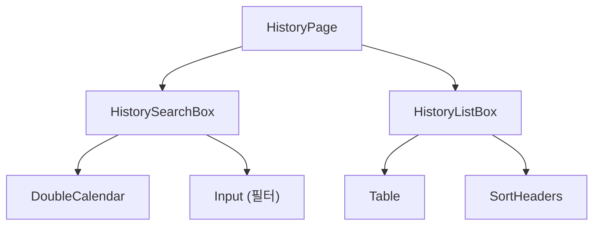
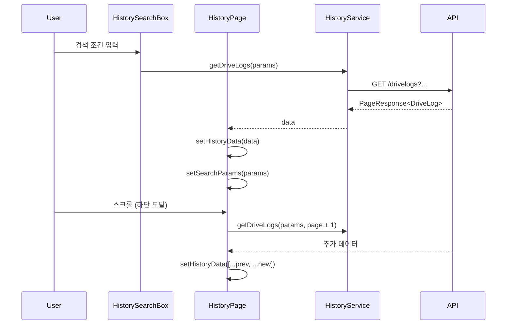

# Module: History (주행 기록)

> 차량 주행 이력 검색 및 조회

---

## 개요

주행 기록 페이지는 차량의 주행 이력을 날짜, 차량, 브랜드 등 다양한 조건으로 검색하고 조회할 수 있습니다.

**경로:** `/history`
**파일:** [src/app/history/page.tsx](../src/app/history/page.tsx)

---

## 스크린샷

```
┌─────────────────────────────────────────────────────────┐
│  [TopBar]  2 the Core                    [AccountMenu]  │
│  ───────────────────────────────────────────────────────│
│  [차량 검색] [주행 기록] [데이터 분석] [에뮬레이터]       │
├─────────────────────────────────────────────────────────┤
│  ┌─────────────────────────────────────────────────────┐│
│  │ 시작일: [2024-01-01] ~ 종료일: [2024-01-31]         ││
│  │ 차량번호: [        ] 브랜드: [      ] [검색]        ││
│  └─────────────────────────────────────────────────────┘│
│  ┌─────────────────────────────────────────────────────┐│
│  │ 차량번호 ▲ | 브랜드 | 시작시간 | 종료시간 | 거리    ││
│  ├─────────────────────────────────────────────────────┤│
│  │ 12가 1234 | 현대 아반떼 | 09:00 | 18:00 | 45.5km   ││
│  ├─────────────────────────────────────────────────────┤│
│  │ 23나 2345 | 기아 K5     | 10:30 | 17:00 | 32.0km   ││
│  ├─────────────────────────────────────────────────────┤│
│  │ ...                                                 ││
│  └─────────────────────────────────────────────────────┘│
└─────────────────────────────────────────────────────────┘
```

---

## 컴포넌트 구조



---

## 주요 기능

### 1. 날짜 범위 검색

시작일과 종료일을 선택하여 해당 기간의 주행 기록을 조회합니다.

### 2. 필터 검색

| 필터 | 설명 |
|------|------|
| 차량 번호 | 특정 차량의 기록만 조회 |
| 브랜드 | 브랜드별 필터링 |
| 모델 | 모델별 필터링 |
| 상태 | 차량 상태별 필터링 |

### 3. 정렬

테이블 헤더 클릭으로 오름차순/내림차순 정렬.

| 정렬 기준 | sortBy 값 |
|-----------|-----------|
| 차량 번호 | `carNumber` |
| 시작 시간 | `startTime` |
| 종료 시간 | `endTime` |
| 브랜드 | `brand` |
| 모델 | `model` |
| 주행 거리 | `driveDist` |

### 4. 무한 스크롤

스크롤 시 자동으로 추가 데이터를 로드합니다.

---

## 상태 관리

### 로컬 상태

```typescript
// src/app/history/page.tsx:12-19
const [historyData, setHistoryData] = useState<DriveLog[]>([]);
const [loading, setLoading] = useState(false);
const [searchParams, setSearchParams] = useState<DriveLogQueryParams>({});

// 무한 스크롤
const { page, setPage, isFetching, setIsFetching, setLastIntersecting } = useObserver();
const [hasNextPage, setHasNextPage] = useState(true);
```

---

## 데이터 타입

### DriveLogQueryParams

```typescript
// src/services/history-service.ts:4-17
interface DriveLogQueryParams {
  carNumber?: string;
  status?: string;
  brand?: string;
  model?: string;
  startTime?: Date;
  endTime?: Date;
  twoParam?: boolean;
  page?: number;
  offset?: number;
  sortBy?: string;
  sortOrder?: 'ASC' | 'DESC';
}
```

### DriveLog

```typescript
// src/services/history-service.ts:20-30
interface DriveLog {
  carNumber: string;
  model: string;
  brand: string;
  startTime: string;
  endTime: string;
  startPoint: string;
  endPoint: string;
  driveDist: number;
  status: string;
}
```

---

## 데이터 흐름



---

## API 호출

### 주행 기록 조회

```typescript
// src/services/history-service.ts:33-63
static async getDriveLogs(
  params?: DriveLogQueryParams,
  page: number = 1,
  offset: number = 10
): Promise<PageResponse<DriveLog>> {
  const queryParams = new URLSearchParams();

  if (params?.carNumber) queryParams.set('carNumber', params.carNumber);
  if (params?.startTime) {
    queryParams.set('startTime', params.startTime.toISOString().split('T')[0]);
  }
  if (params?.endTime) {
    queryParams.set('endTime', params.endTime.toISOString().split('T')[0]);
  }

  queryParams.set('page', String(page));
  queryParams.set('offset', String(offset));
  queryParams.set('sortBy', params?.sortBy || 'startTime');
  queryParams.set('sortOrder', params?.sortOrder || 'ASC');

  const response = await mainApi.get(`/drivelogs?${queryParams.toString()}`);
  return response.data.data;
}
```

---

## 정렬 처리

```typescript
// src/app/history/page.tsx:57-76
const handleSort = async (sortBy: string, order: 'ASC' | 'DESC') => {
  setLoading(true);
  try {
    const updatedParams: DriveLogQueryParams = {
      ...searchParams,
      sortBy,
      sortOrder: order,
    };
    setSearchParams(updatedParams);

    const response = await HistoryService.getDriveLogs(updatedParams);
    setHistoryData(response.content);
    setPage(1);
    setHasNextPage(response.content.length === 10);
  } finally {
    setLoading(false);
  }
};
```

---

## 컴포넌트 상세

### HistorySearchBox

**파일:** [src/components/history-search-box/history-search-box.tsx](../src/components/history-search-box/history-search-box.tsx)

```typescript
interface HistorySearchBoxProps {
  onSearchResults: (data: DriveLog[], params?: DriveLogQueryParams) => void;
  onLoadingChange: (loading: boolean) => void;
}
```

### HistoryListBox

**파일:** [src/components/history-search-box/history-list-box/history-list-box.tsx](../src/components/history-search-box/history-list-box/history-list-box.tsx)

```typescript
interface HistoryListBoxProps {
  historyData: DriveLog[];
  loading: boolean;
  onSort: (sortBy: string, order: 'ASC' | 'DESC') => void;
  setLastIntersecting: (element: HTMLElement | null) => void;
}
```

### DoubleCalendar

**파일:** [src/components/history-search-box/double-calendar.tsx](../src/components/history-search-box/double-calendar.tsx)

시작일/종료일 선택을 위한 날짜 선택기.

```typescript
interface DoubleCalendarProps {
  startTime: Date;
  endTime: Date;
  onStartTimeChange: (date: Date | undefined) => void;
  onEndTimeChange: (date: Date | undefined) => void;
}
```

---

## 무한 스크롤

```typescript
// src/app/history/page.tsx:22-55
useEffect(() => {
  if (page === 1 || !hasNextPage || Object.keys(searchParams).length === 0) return;

  const loadMoreLogs = async () => {
    setIsFetching(true);
    const result = await HistoryService.getDriveLogs(searchParams, page, 10);

    if (result.content.length > 0) {
      setHistoryData(prevLogs => [...prevLogs, ...result.content]);
      setHasNextPage(result.content.length === 10);
    } else {
      setHasNextPage(false);
    }
    setIsFetching(false);
  };

  loadMoreLogs();
}, [page, searchParams, hasNextPage]);
```

---

## 검색 결과 콜백

```typescript
// src/app/history/page.tsx:78-88
const handleSearchResults = (
  data: DriveLog[],
  params?: DriveLogQueryParams
) => {
  setHistoryData(data);
  if (params) {
    setSearchParams(params);
    setPage(1);
    setHasNextPage(data.length === 10);
  }
};
```

---

## 스타일

- [src/components/history-search-box/history-list-box/history-list-box.module.css](../src/components/history-search-box/history-list-box/history-list-box.module.css)

---

## 관련 문서

- [API-Reference](API-Reference) - 주행 기록 API
- [Data-Flow](Data-Flow) - 데이터 흐름
- [Module-Search](Module-Search) - 차량 검색
