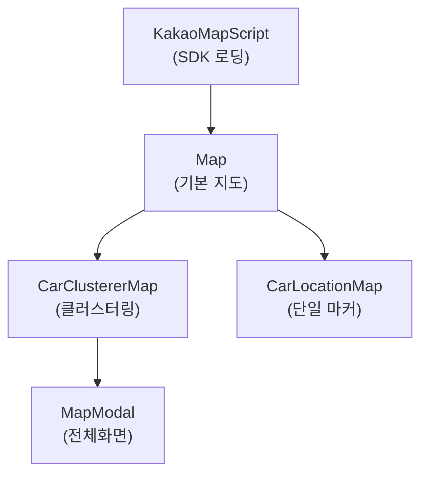
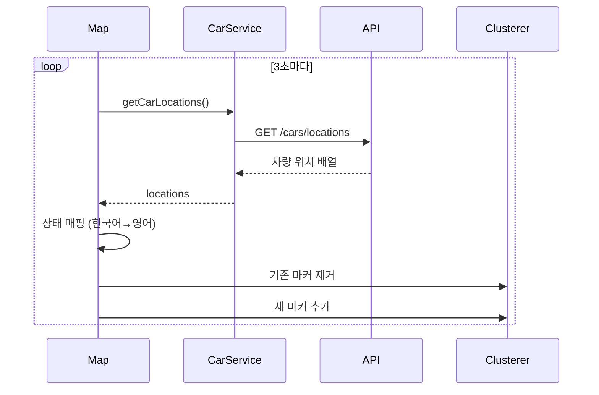

# Module: Maps (Kakao Maps 통합)

> Kakao Maps SDK 기반 차량 위치 시각화 컴포넌트

---

## 개요

Maps 모듈은 Kakao Maps JavaScript SDK를 사용하여 차량 위치를 지도에 표시합니다.

**디렉토리:** `src/components/map/`

---

## 컴포넌트 목록

| 컴포넌트 | 파일 | 역할 |
|----------|------|------|
| `KakaoMapScript` | [kakao-map-script.tsx](../src/components/map/kakao-map-script.tsx) | SDK 스크립트 로딩 |
| `Map` | [map.tsx](../src/components/map/map.tsx) | 기본 지도 컴포넌트 |
| `CarClustererMap` | [car-clusterer-map.tsx](../src/components/map/car-clusterer-map.tsx) | 클러스터링 지도 |
| `CarLocationMap` | [car-location-map.tsx](../src/components/map/car-location-map.tsx) | 개별 차량 위치 |
| `MapModal` | [map-modal.tsx](../src/components/map/map-modal.tsx) | 전체화면 지도 모달 |

---

## 컴포넌트 계층



---

## KakaoMapScript

**파일:** [src/components/map/kakao-map-script.tsx](../src/components/map/kakao-map-script.tsx)

Kakao Maps SDK를 동적으로 로드합니다.

```typescript
// 사용 예시
<KakaoMapScript />
<CarClustererMap ... />
```

**특징:**
- 중복 로딩 방지
- 클러스터링 라이브러리 포함
- 로딩 완료 콜백 지원

---

## Map (기본 지도)

**파일:** [src/components/map/map.tsx](../src/components/map/map.tsx)

```typescript
interface MapProps {
  width: string;
  height: string;
  onLoad?: (mapInstance: any) => void;
  enableAutoRefresh?: boolean;
  onCarsUpdate?: (cars: Car[]) => void;
  showMarkers?: boolean;
  zoomLevel?: number;
}

interface Car {
  carNumber: string;
  status: 'driving' | 'maintenance' | 'idle';
  lastLatitude: string;
  lastLongitude: string;
}
```

### 주요 기능

#### 1. 지도 초기화

```typescript
const initializeMap = () => {
  const container = mapContainerRef.current;
  const options = {
    center: new window.kakao.maps.LatLng(37.5665, 126.978),
    level: zoomLevel,
  };
  const map = new window.kakao.maps.Map(container, options);
  onLoad?.(map);
};
```

#### 2. 실시간 데이터 갱신

```typescript
// 3초 간격 자동 갱신
useEffect(() => {
  if (!enableAutoRefresh) return;

  const fetchCarLocations = async () => {
    const locations = await CarService.getCarLocations();
    const mappedCars = locations.map(car => ({
      ...car,
      status: mapKoreanStatusToEnglish(car.status),
    }));
    onCarsUpdate?.(mappedCars);
  };

  const intervalId = setInterval(fetchCarLocations, 3000);
  return () => clearInterval(intervalId);
}, [enableAutoRefresh]);
```

---

## CarClustererMap (클러스터링 지도)

**파일:** [src/components/map/car-clusterer-map.tsx](../src/components/map/car-clusterer-map.tsx)

여러 차량을 클러스터링하여 표시합니다.

```typescript
interface CarClustererMapProps {
  width: string;
  height: string;
  carStatusFilter: 'total' | 'driving' | 'maintenance' | 'idle';
  onOpenModal?: () => void;
  isMapModalOpen?: boolean;
}
```

### 클러스터러 초기화

```typescript
// src/components/map/car-clusterer-map.tsx:33-73
clustererRef.current = new window.kakao.maps.MarkerClusterer({
  map: mapRef.current,
  averageCenter: true,
  minLevel: 10,
  disableClickZoom: false,
});

// 클러스터 클릭 이벤트
window.kakao.maps.event.addListener(
  clustererRef.current,
  'clusterclick',
  function (cluster) {
    mapRef.current.setLevel(mapRef.current.getLevel() - 1, {
      anchor: cluster.getCenter(),
      animate: { duration: 350 },
    });
  }
);
```

### 마커 생성

```typescript
// src/components/map/car-clusterer-map.tsx:79-136
const statusToImage = {
  driving: '/car_green.png',
  maintenance: '/car_red.png',
  idle: '/car_yellow.png',
};

const markers = filteredCars
  .filter(car => car.lastLatitude && car.lastLongitude)
  .map(car => {
    const markerImage = new window.kakao.maps.MarkerImage(
      statusToImage[car.status],
      new window.kakao.maps.Size(32, 32),
      { offset: new window.kakao.maps.Point(16, 32) }
    );

    const marker = new window.kakao.maps.Marker({
      position: new window.kakao.maps.LatLng(
        parseFloat(car.lastLatitude),
        parseFloat(car.lastLongitude)
      ),
      image: markerImage,
      title: car.carNumber,
    });

    return marker;
  });

clustererRef.current.addMarkers(markers);
```

### 필터링

```typescript
const filteredCars = carStatusFilter === 'total'
  ? updatedCars
  : updatedCars.filter(car => car.status === carStatusFilter);
```

---

## CarLocationMap (개별 차량)

**파일:** [src/components/map/car-location-map.tsx](../src/components/map/car-location-map.tsx)

단일 차량의 위치를 표시합니다.

```typescript
interface CarLocationMapProps {
  width: string;
  height: string;
  carNumber: string;
  lastLatitude?: string;
  lastLongitude?: string;
  status: 'driving' | 'maintenance' | 'idle';
}
```

### 사용 예시

```tsx
<CarLocationMap
  width="100%"
  height="400px"
  carNumber="12가 1234"
  lastLatitude="37.5665"
  lastLongitude="126.9780"
  status="driving"
/>
```

---

## MapModal (전체화면)

**파일:** [src/components/map/map-modal.tsx](../src/components/map/map-modal.tsx)

```typescript
interface MapModalProps {
  isOpen: boolean;
  onClose: () => void;
}
```

전체화면 지도 뷰를 제공합니다.

---

## 마커 아이콘

| 상태 | 파일 | 색상 |
|------|------|------|
| driving (운행) | `/car_green.png` | 🟢 녹색 |
| idle (대기) | `/car_yellow.png` | 🟡 노란색 |
| maintenance (수리) | `/car_red.png` | 🔴 빨간색 |

---

## 상태 매핑

한국어 상태를 영어로 변환:

```typescript
const mapKoreanStatusToEnglish = (
  status: '운행' | '대기' | '수리'
): 'driving' | 'idle' | 'maintenance' => {
  const statusMap = {
    '운행': 'driving',
    '대기': 'idle',
    '수리': 'maintenance',
  };
  return statusMap[status] || 'idle';
};
```

---

## 지도 이벤트

### 마커 클릭

```typescript
window.kakao.maps.event.addListener(marker, 'click', function () {
  const position = marker.getPosition();
  mapRef.current.setLevel(3, { animate: { duration: 350 } });
  mapRef.current.setCenter(position);
});
```

### 클러스터 클릭

```typescript
window.kakao.maps.event.addListener(clusterer, 'clusterclick', function (cluster) {
  const center = cluster.getCenter();
  mapRef.current.setLevel(mapRef.current.getLevel() - 1, {
    anchor: center,
    animate: { duration: 350 },
  });
});
```

---

## TypeScript 타입

**파일:** [src/types/kakao.d.ts](../src/types/kakao.d.ts)

Kakao Maps SDK 타입 정의.

---

## 스타일

- [src/components/map/map.module.css](../src/components/map/map.module.css)
- [src/components/map/map-modal.module.css](../src/components/map/map-modal.module.css)

---

## 데이터 흐름



---

## 관련 문서

- [Module-Dashboard](Module-Dashboard) - 대시보드에서 지도 사용
- [Module-Detail](Module-Detail) - 상세 페이지에서 지도 사용
- [API-Reference](API-Reference) - 위치 API
