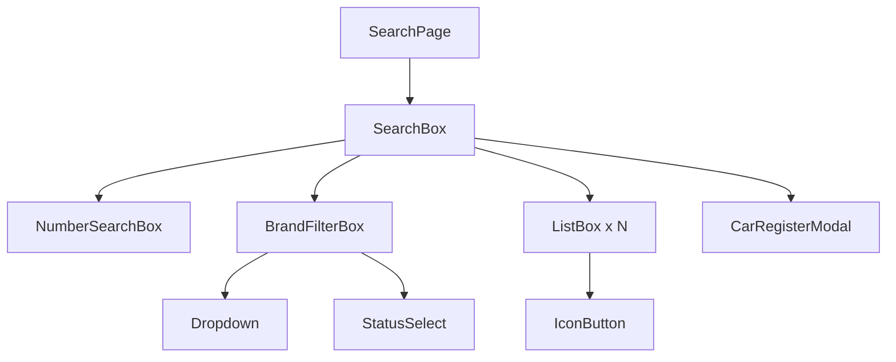
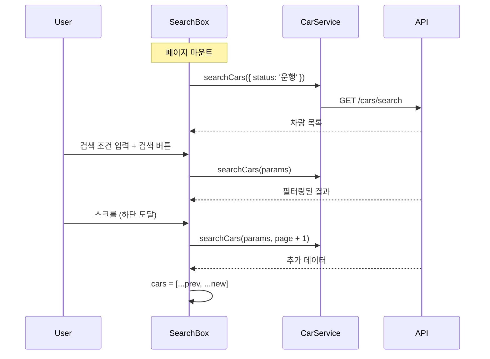

# Module: Search (차량 검색)

> 차량 목록 조회, 검색, 필터링 및 등록 기능

---

## 개요

차량 검색 페이지는 전체 차량 목록을 조회하고 다양한 조건으로 필터링할 수 있는 기능을 제공합니다.

**경로:** `/search`
**파일:** [src/app/search/page.tsx](../src/app/search/page.tsx)

---

## 스크린샷

```
┌─────────────────────────────────────────────────────────┐
│  [TopBar]  2 the Core                    [AccountMenu]  │
│  ───────────────────────────────────────────────────────│
│  [차량 검색] [주행 기록] [데이터 분석] [에뮬레이터]       │
├─────────────────────────────────────────────────────────┤
│  ┌─────────────────────────────────────────────────────┐│
│  │ 🔍 차량번호 검색          [검색]                    ││
│  └─────────────────────────────────────────────────────┘│
│  ┌─────────────────────────────────────────────────────┐│
│  │ 차량명: [          ]  상태: [운행 ▼]  [검색]        ││
│  └─────────────────────────────────────────────────────┘│
│  ┌─────────────────────────────────────────────────────┐│
│  │ 12가 1234 | 현대 아반떼 | 🟢 운행     [상세] [삭제] ││
│  ├─────────────────────────────────────────────────────┤│
│  │ 23나 2345 | 기아 K5     | 🟡 대기     [상세] [삭제] ││
│  ├─────────────────────────────────────────────────────┤│
│  │ 34다 3456 | 현대 소나타 | 🔴 수리     [상세] [삭제] ││
│  └─────────────────────────────────────────────────────┘│
│                                                    [+]  │
└─────────────────────────────────────────────────────────┘
```

---

## 컴포넌트 구조



---

## 주요 기능

### 1. 차량 번호 검색

차량 번호로 직접 검색합니다.

```typescript
// src/components/search-box/search-box.tsx:93-142
const handleNumberSearch = async () => {
  const searchParams: CarSearchParams = {
    carNumber: carNumber.trim(),
    status: status,
    page: 1,
    offset: 10,
  };
  const result = await CarService.searchCars(searchParams);
  setCars(result.content);
};
```

### 2. 필터 검색

브랜드/모델명과 상태로 필터링합니다.

| 필터 | 타입 | 예시 |
|------|------|------|
| 차량명 | `string` | "현대 아반떼", "기아", "소나타" |
| 상태 | `'운행' \| '대기' \| '수리'` | 운행 |

### 3. 무한 스크롤

`useObserver` 훅을 사용한 무한 스크롤 구현.

```typescript
// src/components/search-box/search-box.tsx:35-64
useEffect(() => {
  if (page === 1 || !hasNextPage) return;

  const loadMoreCars = async () => {
    const result = await CarService.searchCars(currentSearchParams, page, 10);
    setCars(prevCars => [...prevCars, ...result.content]);
    setHasNextPage(result.content.length === 10);
  };

  loadMoreCars();
}, [page, currentSearchParams, hasNextPage]);
```

### 4. 차량 등록

플로팅 버튼(+)을 클릭하여 새 차량을 등록합니다.

---

## 상태 관리

### 로컬 상태

```typescript
// src/components/search-box/search-box.tsx:10-28
const [cars, setCars] = useState<Car[]>([]);
const [loading, setLoading] = useState(true);
const [error, setError] = useState<string | null>(null);

// 검색 조건
const [carNumber, setCarNumber] = useState('');
const [brandModel, setBrandModel] = useState('');
const [status, setStatus] = useState('운행');

// 모달
const [isModalOpen, setIsModalOpen] = useState(false);

// 무한 스크롤
const { page, setPage, isFetching, setIsFetching, setLastIntersecting } = useObserver();
const [hasNextPage, setHasNextPage] = useState(true);
const [currentSearchParams, setCurrentSearchParams] = useState<CarSearchParams | null>(null);
```

---

## 데이터 흐름



---

## 컴포넌트 상세

### NumberSearchBox

**파일:** [src/components/search-box/number-search-box.tsx](../src/components/search-box/number-search-box.tsx)

```typescript
interface NumberSearchBoxProps {
  value: string;
  onChange: (value: string) => void;
  onSearch: () => void;
}
```

### BrandFilterBox (FilterBox)

**파일:** [src/components/search-box/filter-box.tsx](../src/components/search-box/filter-box.tsx)

```typescript
interface BrandFilterBoxProps {
  brandModel: string;
  setBrandModel: (value: string) => void;
  status: string;
  setStatus: (value: string) => void;
  onSearch: () => void;
}
```

### ListBox

**파일:** [src/components/search-box/list-box/list-box.tsx](../src/components/search-box/list-box/list-box.tsx)

```typescript
interface ListBoxProps {
  carNumber: string;
  brand: string;
  model: string;
  status: '운행' | '대기' | '수리';
  onDelete: (carNumber: string) => void;
  ref?: React.Ref<HTMLDivElement>;
}
```

**기능:**
- 차량 정보 표시
- 상세 페이지 이동 (`/detail?carNumber=...`)
- 차량 삭제

### CarRegisterModal

**파일:** [src/components/search-box/car-register-modal.tsx](../src/components/search-box/car-register-modal.tsx)

새 차량 등록 모달 폼.

---

## API 호출

### 초기 로드

```typescript
// src/components/search-box/search-box.tsx:66-90
const loadInitialCars = async () => {
  const searchParams: CarSearchParams = {
    status: status,  // 기본값: '운행'
    page: 1,
    offset: 10,
  };
  const carData = await CarService.searchCars(searchParams);
  setCars(carData.content);
};
```

### 검색

```typescript
// API: GET /cars/search
const result = await CarService.searchCars({
  carNumber: '12가',      // 옵션
  brand: '현대',          // 옵션
  model: '아반떼',        // 옵션
  status: '운행',         // 옵션
  twoParam: true,         // 브랜드+모델 모두 있을 때
  page: 1,
  offset: 10,
});
```

### 삭제

```typescript
// src/components/search-box/list-box/list-box.tsx
await CarService.deleteCar(carNumber);
```

---

## 검색 파라미터 처리

브랜드와 모델 분리 로직:

```typescript
// src/components/search-box/search-box.tsx:99-123
if (brandModel.trim()) {
  const parts = brandModel.trim().split(/\s+/);
  const brand = parts[0] || '';
  const model = parts.slice(1).join(' ') || '';

  if (brand && model) {
    searchParams.brand = brand;
    searchParams.model = model;
    searchParams.twoParam = true;
  } else if (brand) {
    searchParams.brand = brand;
    searchParams.twoParam = false;
  }
}
```

| 입력 | brand | model | twoParam |
|------|-------|-------|----------|
| "현대 아반떼" | "현대" | "아반떼" | true |
| "현대" | "현대" | - | false |
| "아반떼" | "아반떼" | - | false |

---

## 무한 스크롤 구현

### useObserver 훅

**파일:** [src/hooks/use-intersection-observer.ts](../src/hooks/use-intersection-observer.ts)

```typescript
const { page, setPage, isFetching, setIsFetching, setLastIntersecting } = useObserver();
```

### 마지막 아이템에 ref 연결

```tsx
// src/components/search-box/search-box.tsx:277-291
{cars.map((car, idx) => (
  <ListBox
    key={`${car.carNumber}-${idx}`}
    {...car}
    ref={
      idx === cars.length - 1 && hasNextPage
        ? setLastIntersecting
        : null
    }
  />
))}
```

---

## 스타일

- [src/components/search-box/floating.module.css](../src/components/search-box/floating.module.css) - 플로팅 버튼
- [src/components/search-box/list-box/list-box.module.css](../src/components/search-box/list-box/list-box.module.css) - 리스트 아이템
- [src/components/search-box/search-filter.module.css](../src/components/search-box/search-filter.module.css) - 필터 박스

---

## 관련 문서

- [Module-Detail](Module-Detail) - 차량 상세 페이지
- [API-Reference](API-Reference) - 차량 API
- [Data-Flow](Data-Flow) - 데이터 흐름
